# AI-Native Project Management: Building for Collaborators Without Memory

*Why traditional PM tools assume your AI remembers yesterday, and what to do about it*

---


## The Problem I Couldn't Ignore

It was 11 PM on a Wednesday. I had just finished a productive 3-hour session with Claude, building a hybrid search engine for codebases. We'd fixed a critical bug, implemented a new feature, and discovered an elegant optimization.

Then I closed the terminal.

The next morning, I opened a fresh Claude session and typed: "Let's continue from yesterday."

Claude responded with enthusiasm, helpfulness, and complete amnesia.

All our discoveries—gone.
All our context—evaporated.
All our decisions—forgotten.

This is the "Groundhog Day" problem of AI-assisted development.

```mermaid
graph LR
    A[Session 1<br/>11 PM Wed] -->|Close terminal| B[💭 Context Lost]
    B -->|New session| C[Session 2<br/>9 AM Thu]

    A -->|Has context| D[✅ Bug fixed<br/>✅ Feature added<br/>✅ Optimization found]
    C -->|No context| E[❌ What bug?<br/>❌ What feature?<br/>❌ What optimization?]

    style B fill:#ff6b6b
    style D fill:#51cf66
    style E fill:#ff6b6b
```



**AI doesn't have memory. And every PM tool I'd tried assumed it did.**

---

## Why Traditional PM Tools Fail with AI

I'd tried everything. Jira. Linear. Notion. GitHub Projects. Obsidian with fancy plugins. They all made the same fundamental mistake: they were designed for humans who naturally remember context between sessions.

Here's what happens when you try to use traditional PM with AI:

| Traditional PM Assumption | Reality with AI |
|--------------------------|-----------------|
| "We discussed this yesterday" | AI has no yesterday |
| "You know the architecture" | AI knows nothing unless told |
| "Remember that decision we made?" | What decision? |
| "Continue the implementation" | What implementation? |

Every morning was a reset. Every session started from zero. I spent more time re-explaining context than making progress. (read context engineering)

The worst part? The AI was doing incredible work, then losing all of it. Discoveries evaporated. Patterns went unrecognized. The same bugs got investigated multiple times.

**I had a collaborator with extraordinary capability and somewhat zero retention (unless properly maintained considering context budget).**

---

## The Core Insight

The solution was embarrassingly simple:

> **"If AI can't remember it, write it to a file."**

Not a database. Not a cloud service. Not a fancy tool. A file. In the repo. Where AI can read it at the start of every session.

This single principle became the foundation of **aman-pm** - an AI-native project management system that treats AI as a participant in the workflow, not just an assistant you occasionally consult.

```mermaid
graph TD
    subgraph "❌ Traditional Approach: Volatile Memory"
        A1[AI Session 1] -->|Context window| B1[Temporary state]
        B1 -->|Session ends| C1[💨 Context evaporates]
        C1 --> D1[AI Session 2]
        D1 -->|Starts from zero| E1[❌ No memory]
    end

    subgraph "✅ aman-pm: Persistent Memory"
        A2[AI Session 1] -->|Reads| B2[📁 Files in repo]
        A2 -->|Writes learnings| B2
        B2 -->|Persists in git| C2[📦 Committed state]
        C2 --> D2[AI Session 2]
        D2 -->|Reads| B2
        D2 -->|Has full context| E2[✅ Builds on past]
    end

    style C1 fill:#ff6b6b
    style E1 fill:#ff6b6b
    style B2 fill:#51cf66
    style E2 fill:#51cf66
```



---

## Who This Is For

This system is designed for:

- **Solo developers** working with AI coding assistants (Claude 4.5, GPT-4o, Gemini 2.0, etc.)
- **Small teams** (2-5 people) doing AI-pair programming
- **Open source maintainers** who work asynchronously across sessions
- **Anyone who has ever typed "what did we decide about X?" to their AI**

If you've experienced the frustration of re-explaining context every session, or watched valuable insights evaporate between conversations, this is for you.

You don't need to be managing a large team or running sprints formally. You just need to be building something non-trivial with AI and want that collaboration to accumulate value instead of resetting to zero.

---

## What Makes "aman-pm" Different

Traditional PM systems track work for humans. aman-pm tracks work *and context* for AI.


```
Traditional PM:                    AI-Native PM (aman-pm):
┌─────────────────┐               ┌─────────────────────────────┐
│ Human remembers │               │ Files remember              │
│ Human tracks    │       vs      │ AI reads files at start     │
│ Tools are dumb  │               │ AI updates files at end     │
└─────────────────┘               │ Learnings persist forever   │
                                  └─────────────────────────────┘
```

### The Three-Command Workflow


Most PM systems overwhelm you with features. aman-pm reduces daily operations to three commands:

| Command | What Happens |
|---------|-------------|
| `/aman start` | Loads context, surfaces memory, shows recommendations |
| `/aman` | Quick status check during work |
| `/aman end` | Captures learnings, generates handoff document |

Sync happens automatically. Archiving happens automatically. Status updates happen automatically. You focus on the work.

```mermaid
flowchart TD
    Start["/aman start"] --> Load[Load Context]
    Load --> Show1["📖 Current sprint items"]
    Load --> Show2["💡 Recent learnings"]
    Load --> Show3["🎯 Last session recommendation"]

    Show1 --> Work[Do Work]
    Show2 --> Work
    Show3 --> Work

    Work -->|Need status?| Quick["/aman"]
    Quick --> Continue{Continue<br/>working?}
    Continue -->|Yes| Work

    Continue -->|No| End["/aman end"]
    Work -->|Session done| End

    End --> Capture1["✍️ Capture learnings"]
    End --> Capture2["📝 Generate handoff"]
    End --> Capture3["🔄 Update sprint state"]

    Capture1 --> Persist[Commit to git]
    Capture2 --> Persist
    Capture3 --> Persist

    Persist --> Next["Next session reads<br/>this state"]
    Next -.->|Tomorrow| Start

    style Start fill:#51cf66
    style Work fill:#74c0fc
    style End fill:#ffd43b
    style Persist fill:#51cf66
```



### The Memory Layer

The `knowledge/` directory serves as AI's persistent storage:

```

.aman-pm/knowledge/
├── learnings.md      # Technical discoveries that survive sessions
├── decisions.md      # Architecture decisions with rationale
├── patterns.md       # Observed patterns (what works, what doesn't)
└── velocity.json     # Historical velocity data for predictions

```

When a session starts, the AI reads these files. When it ends, discoveries get persisted. Context accumulates instead of resetting.

**Example from a real `learnings.md` entry:**

```markdown
## 2026-01-10: Bleve Index Corruption Recovery

**Problem**: Users reported crashes on startup with cryptic "index read error"
**Investigation**: Index corruption from ungraceful shutdown (kill -9, power loss)
**Solution**: Auto-detect corrupt index, clear with warning message
**Learning**: Graceful degradation > error-and-die. Users prefer "search rebuilt" over crash.

**Code**: `pkg/search/bleve.go:156`
**Related Decision**: ADR-008 (Local-first means auto-recovery)
**Pattern**: "Lazy engineer audit" revealed this and 3 similar hidden failures
```

This entry persists across all future sessions. When similar corruption happens in a different component, the AI references this pattern instead of starting from scratch.

### Session Handoffs: Explicit Boundaries

Every session produces a handoff document that captures:

- What was accomplished
- What was learned
- What files changed
- What the next session should focus on

These handoffs create an audit trail. You can trace exactly what happened, when, and why. No more reconstructing history from git commits and vague recollections.

### Memory Compaction: Solving Context Window Economics

As learnings accumulate over months, reading the entire `learnings.md` file every session becomes token-expensive. aman-pm uses a two-tier memory strategy:

**Tier 1: Always Load** (< 1000 tokens)

- Current sprint context
- Last 3 session handoffs
- Decisions from last 30 days
- Active patterns and in-progress items

**Tier 2: On-Demand** (Semantic search when needed)

- Historical learnings (archived by quarter)
- Old sprint retrospectives
- Closed decisions from past sprints

This keeps cold-start fast (< 30 seconds) while preserving deep history. When you ask "didn't we try approach X before?", the AI searches Tier 2 archives and surfaces relevant context.

The system automatically promotes frequently-referenced learnings from Tier 2 back to Tier 1, ensuring important patterns stay accessible.

```mermaid
graph TB
    subgraph "🚀 Tier 1: Always Loaded (< 1000 tokens)"
        T1A["📍 Current Sprint<br/>(sprint-6.md)"]
        T1B["📝 Last 3 Handoffs<br/>(2026-01-11/12/13)"]
        T1C["🎯 Recent Decisions<br/>(Last 30 days)"]
        T1D["⚡ Active Patterns<br/>(In progress)"]
    end

    subgraph "📦 Tier 2: On-Demand (Semantic Search)"
        T2A["📚 Historical Learnings<br/>(Q4 2025, Q3 2025...)"]
        T2B["🔍 Old Retrospectives<br/>(Sprint 1-4)"]
        T2C["🗄️ Closed Decisions<br/>(ADR archive)"]
    end

    Start["/aman start"] --> T1A
    Start --> T1B
    Start --> T1C
    Start --> T1D

    Query["❓ User asks:<br/>'Didn't we try X before?'"] --> Search[Semantic Search]
    Search --> T2A
    Search --> T2B
    Search --> T2C

    T2A -->|Frequently referenced| Promote["⬆️ Promote to Tier 1"]
    Promote --> T1D

    T1D -->|Gets stale| Archive["⬇️ Archive to Tier 2"]
    Archive --> T2A

    style Start fill:#51cf66
    style Query fill:#74c0fc
    style Promote fill:#ffd43b
    style Archive fill:#ff6b6b
```



---

## The Transformation: Real Numbers

I didn't just build aman-pm. I used it daily while building [AmanMCP](https://github.com/Aman-CERP/amanmcp), a local-first RAG server for developers.

Here's what changed:

### Before aman-pm

- Context re-establishment: ~30 minutes per session
- Duplicate investigation of issues: ~40% of bugs
- Lost learnings: "We solved this before... somewhere"
- Sprint completion: Ad hoc, unmeasured
- Planning: Scattered across 15+ documents

### After aman-pm

| Metric | Before | After |
|--------|--------|-------|
| Context load time | 30 min | 30 seconds |
| Duplicate investigations | 40% | <5% |
| Lost learnings | Many | Zero |
| Sprint completion rate | Unknown | 100% (4-sprint streak) |
| Documentation sprawl | Severe | Controlled |

**How these were measured:**

- **Context load time**: Timestamped from "Hi Claude" to "I understand the current state, let's continue with [specific task]"
- **Duplicate investigations**: Git log analysis of commits addressing same root cause multiple times
- **Lost learnings**: Grep for "we tried this before" and "didn't we already solve this" in chat history
- **Sprint completion**: Items marked 'done' / items committed at sprint start (tracked in velocity.json)
- **Documentation sprawl**: Count of PM-related files outside `.aman-pm/` directory

**Four consecutive sprints with 100% completion.** Not because I worked harder, but because the system retained what mattered.

---

## The Learnings That Survived

Here are real entries from my learnings file — discoveries that would have been lost without persistent memory:

> **Learning**: Auto-recovery UX is better than error-and-die  
> **Context**: Bleve index corruption caused crashes; users had to manually delete files  
> **Action**: Implemented auto-clear with warning message — graceful degradation

> **Learning**: ADR decisions don't implement themselves  
> **Context**: Decided to make MLX default, but code still hardcoded Ollama  
> **Action**: Now trace architecture decisions through to actual implementation

> **Learning**: "Lazy engineer" audits reveal hidden friction  
> **Context**: Proactive UX audit found undocumented env vars, missing PATH auto-config  
> **Action**: Created UX overhaul feature, implemented everything in one sprint

These weren't just notes, they were retrievable context that the AI could reference in future sessions. When a similar situation arose, the AI didn't repeat past mistakes.

---

## The Self-Improving System

Because aman-pm captures learnings and retrospectives, it identifies its own shortcomings.

Every sprint ends with a retrospective:

- What went well?
- What didn't?
- What should change?

Those improvements get implemented in the next sprint.

### Example: The Groom → Sprint Gap

I noticed a pattern: after running `/aman groom` (backlog analysis), I kept forgetting to run `/aman sprint-start`. The context from grooming was lost before I created the sprint.

**The learning was captured:**
> "Backlog grooming should complete the full planning cycle, not end at resequencing"

**The improvement was implemented:**
Now `/aman groom` automatically offers to create the next sprint, displaying a high-level view of project state before prompting for confirmation.

This kind of iterative refinement is only possible because the system records its own friction points.

---

## What aman-pm Looks Like in Practice

### Starting a Session

```

$ /aman start

══════════════════════════════════════════════════════════════════
                          SPRINT 6 - DAY 1
══════════════════════════════════════════════════════════════════
Theme: PM System First - Fix the tools before using them

Items In Progress:
  ○ FEAT-PM1: Sprint Planning Integration in Groom (P0, M)
  ○ FEAT-PM2: Update Velocity.json Automatically (P0, S)
  ○ FEAT-PM3: AI-Powered Velocity Prediction (P1, M)

━━━━━━━━━━━━━━━━━━━━━━━━━━━━━━━━━━━━━━━━━━━━━━━━━━━━━━━━━━━━━━━━━━
                          MEMORY SURFACE
━━━━━━━━━━━━━━━━━━━━━━━━━━━━━━━━━━━━━━━━━━━━━━━━━━━━━━━━━━━━━━━━━━

Recent Learnings:
  • Velocity tracking must be automatic - stale data is worse than no data
  • Go method receiver syntax breaks naive function search patterns
  • Multi-query fusion works best for "How does X work" queries

Last Session Recommendation:
  Start with FEAT-PM1 implementation - review current groom.md structure
══════════════════════════════════════════════════════════════════

```

Within 30 seconds, full context is loaded. The AI knows the current sprint, the priorities, and what was learned last time.

### Ending a Session

```

$ /aman end

Session Summary:
  • Implemented FEAT-PM1 (Sprint Planning Integration)
  • Fixed 3 edge cases in groom command
  • Discovered: velocity.json wasn't being updated at sprint-end

Learnings to Capture?
  ▸ Use AI-suggested (4 learnings detected)

Generating handoff document...
  → Saved: .aman-pm/sessions/archive/sprint-6/2026-01-13-008-handoff.md

Next Session Recommendations:

  1. Verify FEAT-PM2 implementation with mock sprint completion
  2. Consider FEAT-PM3 design if capacity allows

```

The session ends with explicit handoff. Tomorrow's AI—or a different human—can pick up with full context.

---

## Sprint Retrospectives Drive Evolution

Every sprint ends with a retrospective. Here's a real one from Sprint 5:

### What Went Well

- **100% completion in 2 days** - Sprint finished 5 days early
- **Effective triage** - Saved effort by closing features after data-driven analysis
- **6 releases** - Rapid iteration from v0.2.6 to v0.4.0

### What Didn't Go Well

- **Low capacity utilization** (38%) - Could have committed more items
- **2 Tier 1 queries still failing** - Go method syntax mismatch identified but not fixed

### Improvements for Next Sprint

- Commit more items (aim for 60%+ capacity)
- Implement Go method syntax patterns to reach 100% validation

**These findings feed directly into the next sprint's planning.**

---

## The Velocity Data


aman-pm tracks velocity automatically:

| Sprint | Completed | Rate | Notes |
|--------|-----------|------|-------|
| 2 | 20 items | 100% | First formal sprint |
| 3 | 5 items | 100% | Completed in 2 days |
| 4 | 10 items | 100% | Model testing |
| 5 | 5 items | 100% | 6 releases |

**4-sprint 100% completion streak.** The system:

- Captured accurate estimates from past performance
- Recommended realistic commitments
- Flagged stale items automatically
- Surfaced blockers before they became problems

### What Others Are Seeing

Early adopters and collaborators using aman-pm principles report similar patterns:

> "First sprint: 60% completion. Fourth sprint: 95%. The system learns your actual capacity, not your optimistic estimates."
> — Developer using aman-pm for open-source RAG project

> "The handoff documents became our actual project documentation. Totally accidental win. Now when someone asks 'why did we choose X?', I just grep the handoffs directory."
> — Solo SaaS founder building AI-powered code review tool

> "I stopped losing my train of thought between sessions. The AI actually picks up where we left off instead of making me re-explain everything."
> — Researcher prototyping ML infrastructure

The pattern repeats: initial skepticism about "more process overhead," then realization that the overhead is smaller than the daily context-reconstruction tax.

---

## The Philosophy Behind aman-pm

### 1. AI is a Participant, Not an Assistant

Traditional PM: AI assists humans who drive the process.  
AI-Native PM: AI participates in the process with explicit memory and accountability.

### 2. Memory is the Differentiator

Without memory, every session is a cold start. With memory, each session builds on the last.

### 3. Files Over Databases

Complex systems fail. Simple files work. Everything is in the repo, versioned with git, readable by AI.

**Why files are technically superior for AI collaboration:**

- **Git versioning**: Time-travel debugging of decisions. "Why did we decide X in sprint 3?" → `git show sprint-3/.aman-pm/decisions.md`
- **Plain text is LLM-native**: No serialization overhead. AI reads markdown as naturally as you do.
- **Works offline**: No API dependencies, no database connections, no "service unavailable" errors
- **Zero infrastructure**: No setup, no migrations, no schema changes
- **Inspectable by any tool**: `grep`, `ripgrep`, `fzf`, `cat` - the entire Unix toolchain works
- **Diff-friendly**: Code review tools understand what changed in your learnings.md

Databases abstract data away from AI. Files put it directly in the AI's "working memory" (the repo context).

### 4. Accountability Enables Trust

Session handoffs create an audit trail. You can trace exactly what happened and when.

### 5. Improvement is Built-In

Retrospectives and learnings feed back into the system. The PM process evolves alongside the project.

### 6. Team Sync: Handling Concurrent Sessions

What happens when two developers (or two AI sessions) work simultaneously?

**For Small Teams (2-5 people):**

- **Separate session handoffs**: Each person has their own `.aman-pm/sessions/username/` directory
- **Shared learnings**: `learnings.md` uses git merge conflicts as a feature, not a bug
  - Conflict means both developers learned something → discuss and combine
- **Sprint state is append-only**: No overwrites, only additions to sprint logs
- **Daily sync ritual**: Quick 5-min review of others' handoffs each morning

**Concurrency Strategy:**

```markdown
.aman-pm/
├── knowledge/
│   ├── learnings.md         # Shared, merge conflicts expected
│   └── decisions.md         # Shared, append-only
├── sessions/
│   ├── sachin/
│   │   └── 2026-01-13-handoff.md
│   └── dravid/
│       └── 2026-01-13-handoff.md
└── sprints/
    └── sprint-6.md          # Shared, optimistic locking
```

The system embraces git's merge capabilities. When learnings conflict, that's signal: two people discovered related insights independently. Resolve by combining, not choosing.

**Git Branching Strategy: Intentionally Flexible**

aman-pm deliberately avoids prescribing git branching strategies. Whether you use:
- Trunk-based development
- Git Flow (feature/develop/main)
- GitHub Flow (feature branches + main)
- Custom workflows

...is entirely up to you. Branching strategies vary by team, project, and context. aman-pm trusts developers to manage git branching intelligently based on their specific needs.

What aman-pm does provide: session handoffs and learnings that work regardless of your branching model.

```mermaid
sequenceDiagram
    participant Sachin
    participant Repo as .aman-pm/
    participant Dravid

    Note over Sachin,Dravid: Morning: Both pull latest

    Sachin->>Repo: /aman start (reads shared state)
    Dravid->>Repo: /aman start (reads shared state)

    Note over Sachin: Works on Feature A
    Note over Dravid: Works on Feature B

    Sachin->>Repo: Writes sachin/handoff.md
    Sachin->>Repo: Adds learning to learnings.md

    Dravid->>Repo: Writes dravid/handoff.md
    Dravid->>Repo: Adds learning to learnings.md

    Note over Repo: ⚠️ Merge conflict in learnings.md

    Sachin->>Repo: git pull
    Note over Sachin: Sees Dravid's learning + conflict
    Sachin->>Sachin: Combines both learnings
    Sachin->>Repo: git push (resolved)

    Dravid->>Repo: git pull (gets Sachin's combined version)

    Note over Sachin,Dravid: Next morning: Review each other's handoffs
```



### 7. Cross-Model Compatibility

aman-pm files work across AI models (Claude 4.5, GPT-4o, o1, Gemini 2.0, etc.):

**Structured Markdown Convention:**

- **Learnings**: `## YYYY-MM-DD: Title` format (model-agnostic)
- **Decisions**: ADR template (widely recognized across models)
- **Velocity**: JSON (machine-readable by any parser)
- **Handoffs**: Consistent headings (What/Learned/Next)

**Tested Models:**

- Claude 4.5 Sonnet (primary)
- GPT-4o / o1
- Gemini 2.0 Flash

**Migration Between Models:**
No lock-in. Switch from Claude to GPT-4 mid-project, and the new model reads the same memory files. Your learnings persist independent of which LLM you're using.

**Why This Matters:**

- Model performance evolves (today's best might not be tomorrow's)
- Different models excel at different tasks (use Claude 4.5 for code, o1 for reasoning, GPT-4o for docs)
- Cost optimization (switch to cheaper models for simple tasks)

```mermaid
graph LR
    subgraph "📁 Shared Memory (Model-Agnostic)"
        F1["learnings.md<br/>(Markdown)"]
        F2["decisions.md<br/>(ADR template)"]
        F3["velocity.json<br/>(JSON)"]
        F4["handoffs/<br/>(Structured MD)"]
    end

    C["🤖 Claude 4.5"] -->|Reads & Writes| F1
    C -->|Reads & Writes| F2
    C -->|Reads & Writes| F3
    C -->|Reads & Writes| F4

    G["🧠 GPT-5"] -->|Reads & Writes| F1
    G -->|Reads & Writes| F2
    G -->|Reads & Writes| F3
    G -->|Reads & Writes| F4

    Gem["💎 Gemini 3"] -->|Reads & Writes| F1
    Gem -->|Reads & Writes| F2
    Gem -->|Reads & Writes| F3
    Gem -->|Reads & Writes| F4

    User["👤 Developer"] -->|Switches models| C
    User -->|Switches models| G
    User -->|Switches models| Gem

    Note["✅ Memory persists<br/>across model switches"]

    style F1 fill:#51cf66
    style F2 fill:#51cf66
    style F3 fill:#51cf66
    style F4 fill:#51cf66
    style Note fill:#ffd43b
```



---

## Why Other Solutions Didn't Fit

I genuinely tried the alternatives. Here's why each failed for AI collaboration:

**Jira / Linear**: Designed for human teams with persistent memory

- ❌ AI can't efficiently scan 100 issues to understand project state
- ❌ No concept of "what we learned while implementing this"
- ❌ Assumes context persists naturally between team members
- ❌ Status updates require human judgment (AI can't tell if "In Review" is stale)

**Notion / Obsidian**: Flexible documentation, poor AI workflow integration

- ❌ AI reads pages but can't understand your organizational structure
- ❌ No automatic sync between "what AI discovered" and "what got committed"
- ❌ Requires manual discipline (fails when you're tired at 11 PM)
- ❌ No session boundaries - unclear what changed since last time

**GitHub Projects**: Great for issue tracking, not for AI context

- ❌ Issues are write-heavy (AI can't quickly load context from 50 issues)
- ❌ No way to encode "why we decided against approach X"
- ❌ No session boundaries (when did this work actually happen?)
- ❌ Can't capture "what we learned while debugging this"

**Custom GPTs / Claude Projects**: Built-in memory with fatal limitations

- ❌ Memory is opaque (you can't audit what AI remembers)
- ❌ Can't control what it forgets (important decisions may get pruned)
- ❌ Not versioned (no history of how understanding evolved)
- ❌ Locked to one platform (can't switch models while keeping memory)

**aman-pm** differs because it was designed specifically for AI collaboration:

- ✅ Explicit memory files that AI reads and writes
- ✅ Session boundaries with formal handoffs (audit trail)
- ✅ Learnings persist in git-versioned markdown
- ✅ Velocity tracking improves estimation accuracy
- ✅ Works with any AI model (Claude 4.5, GPT-4o, Gemini 2.0, etc.)
- ✅ Fully inspectable and auditable

---

## Announcing: aman-pm Claude Code Plugin

**aman-pm will soon be available as a Claude Code plugin.**

### What You Get

**Immediate (Day 1):**

- `/aman start/end` commands in any Claude Code session
- Automatic handoff generation at session end
- Memory surface showing recent learnings on session start
- Session history with full audit trail

**After 1 Week:**

- Velocity prediction based on your actual completion data
- Sprint planning with confidence intervals (not guesses)
- Learning search: "What did we discover about performance optimization?"
- Pattern recognition across sessions

**After 1 Month:**

- Historical pattern matching: "This bug looks similar to sprint 3, issue FEAT-12"
- Automatic retrospective analysis identifying recurring friction
- Decision lookup: "Why did we choose approach X over Y?"
- Accumulated project knowledge that new team members can instantly access

### Installation (Coming Soon)

```bash
# Install the plugin
claude install aman-pm

# Initialize in any project
/aman init

# Start working with memory
/aman start
```

From that moment, every session builds on the last. No more cold starts. No more lost context.

### From Ideas to Structured Work

One of aman-pm's most powerful features: **the full pipeline from thoughts to backlogs**.

Unlike traditional PM tools that assume you already know what to build, aman-pm helps structure even exploratory and discovery work:

**The Pipeline:**

1. **Capture raw thoughts/ideas** - Brain dump unstructured notes
2. **AI-assisted refinement** - Convert thoughts into requirements
3. **Spec generation** - Transform requirements into structured specifications
4. **Backlog creation** - Generate actionable backlog items with estimates
5. **Backlog grooming** - Restructure and prioritize based on velocity data
6. **Sprint planning** - Allocate items to sprints with confidence intervals

**Example workflow:**

```bash
# Capture exploratory thoughts
/aman idea "What if we added caching to reduce API calls?"

# AI helps structure it
/aman refine-idea
# → Generates: Requirements, performance targets, trade-offs

# Convert to spec
/aman spec-from-idea
# → Creates: Technical specification with approach options

# Generate backlog items
/aman backlog-from-spec
# → Produces: FEAT-42 (Implement Redis cache layer, Priority P1, Size M)
#             FEAT-43 (Add cache invalidation logic, Priority P1, Size S)
#             FEAT-44 (Monitor cache hit rate, Priority P2, Size XS)
```

This means **aman-pm works even when you don't know what you're building yet**. It brings structure to the "figure it out" phase, not just the execution phase.

Your vague ideas become actionable work items automatically.

### Migrating Existing Projects

You don't have to start from zero. aman-pm can bootstrap memory from your existing work:

```bash
/aman init
# Creates .aman-pm/ structure

/aman import-issues
# Scans GitHub/Linear issues, converts to backlog format
# Preserves labels, estimates, and descriptions

/aman learn-from-commits
# Analyzes last 50 commits for patterns
# Suggests initial learnings based on:
#   - Bug fix patterns (similar root causes)
#   - Feature implementation approaches
#   - Refactoring decisions

/aman analyze-docs
# Reads existing ADRs, design docs, READMEs
# Extracts decisions and rationale into decisions.md
```

Within 15 minutes, your project has:

- A populated backlog from existing issues
- Initial learnings extracted from commit history
- Documented decisions from your existing docs
- A baseline for velocity prediction

You're not adding overhead to a greenfield project. You're giving structure to the knowledge you already have scattered across tools.

---

## Continued Dogfooding

I'll be using the aman-pm plugin in all my projects—including the ones I'm already working on.

**AmanMCP** (the hybrid search engine) will continue to use aman-pm for its development. The plugin will manage:

- The remaining search quality features
- Bug fixes and stabilization
- Documentation and release management

Every improvement to the plugin will be tested in actual use before release.

---

## Anti-Patterns to Avoid

From real usage, here's what **doesn't** work:

**❌ Writing TODOs in chat instead of files**
The AI can see them now, but they vanish next session. If it's important, it goes in `backlog.md` or a task tracking file, not in ephemeral conversation.

**❌ Treating `/aman start` as optional**
You'll forget context. The first two weeks feel like overhead. After that, skipping it feels like starting work without coffee. Make it muscle memory.

**❌ Skipping retrospectives "just this once"**
Pattern recognition requires consistent data. Miss one sprint retrospective, lose the ability to spot recurring issues. The system is only as smart as the data you feed it.

**❌ Keeping specs outside the repo**
If AI can't read it, it doesn't exist. That Notion doc with requirements? Move it to `docs/specs/` or accept that AI will never reference it.

**❌ Editing memory files manually without commit messages**
You're building an audit trail. "Update learnings.md" is useless. "Add learning: API rate limiting pattern" is searchable history.

**❌ Using aman-pm for every tiny project**
A weekend prototype with 3 files doesn't need sprint planning. Use it for projects that last >2 weeks and involve >10 meaningful decisions.

**✅ What actually works:**

- Start sessions with `/aman start`, end with `/aman end`. Every time.
- Capture learnings immediately when discovered, not "later"
- Keep all project context in the repo (specs, decisions, patterns)
- Run retrospectives religiously, even 5-minute ones
- Trust the handoffs more than your memory

---

## Try It Yourself

The plugin is coming soon. In the meantime, you can:

1. **Explore the philosophy** in the [AI-Native PM Guide](https://github.com/Aman-CERP/Aman-PM/blob/main/archive/ai-native-pm-guide.md)
2. **See it in action** in the [learnings file](https://github.com/Aman-CERP/Aman-PM/blob/main/archive/learnings.md)
3. **Star the repo** to get notified when the plugin launches

---

## When aman-pm Doesn't Help

Honesty about limitations:

**Interruption-Heavy Days**
If you have 6 different 20-minute sessions across different projects, the handoff overhead becomes real. aman-pm shines with focused 1-2 hour sessions, not context-switching chaos.

**Tiny Projects**
A 2-day script or weekend experiment doesn't need velocity tracking. The system pays for itself on projects lasting 2+ weeks with meaningful complexity.

**Large Teams (>5 people)**
Currently optimized for solo developers or small teams (2-5 people). Larger teams need additional coordination mechanisms beyond what aman-pm provides.

**Real-Time Collaboration**
If you're pair programming with a human in real-time, traditional tools work fine. aman-pm is for asynchronous AI collaboration across sessions.

**Highly Regulated Environments**
Some organizations require PM data in specific compliance systems (Jira for audit trails, etc.). aman-pm can complement but not replace mandated tools.

**The Pattern:**
aman-pm solves **context persistence across AI sessions**. If your problem isn't "AI forgets what we did yesterday," this might not be your tool.

---

## Final Thoughts

The most useful insight from building aman-pm wasn't technical. It was about collaboration:

**AI doesn't need to remember — it needs *you* to remember *for* it.**

Write down what matters. Create explicit handoffs. Capture learnings as they happen. Trust the files, not the context window.

When you do this, the AI becomes a genuine collaborator. It builds on previous work. It avoids past mistakes. It makes connections across sessions.

aman-pm isn't just a PM system. It's a way of working with AI that acknowledges its constraints and works around them systematically.

The question isn't whether AI can help with software development. The question is whether you're preserving the context it needs to help effectively.

---

*Written by Niraj Kumar, creator of AmanMCP and aman-pm*

*The Claude Code plugin is coming soon.*

---

## Appendix: Key Principles

| Principle | Implementation |
|-----------|----------------|
| "If AI can't remember it, write it to a file" | `knowledge/` directory with learnings, decisions, patterns |
| Session boundaries matter | `/aman start` and `/aman end` create explicit context |
| Accountability enables trust | Session handoffs document everything |
| Memory is the differentiator | AI reads state at start, writes state at end |
| Improvement is built-in | Retrospectives feed into next sprint planning |
| Simplicity over features | Three commands: start, status, end |
| Files over databases | Everything in the repo, versioned with git |
| Use your own tools | Dogfooding reveals shortcomings |

---

*Published: 2026-01-13*
*Version: 1.0*
