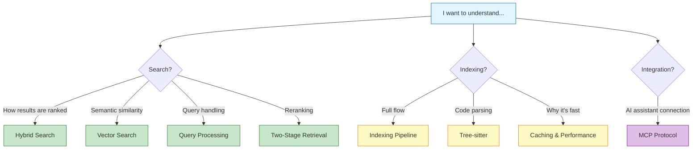
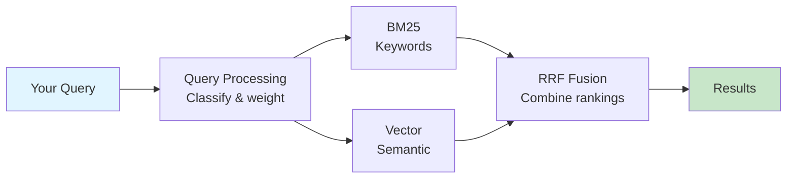
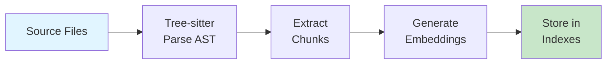
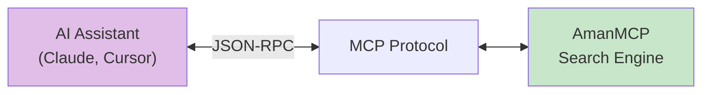

# Concepts: Understanding How AmanMCP Works

This section explains the core concepts and architecture behind AmanMCP. Read these to understand **how** the system works internally.

**Audience**: Users who want to understand the "why" and "how", developers, and anyone curious about the internals.

---

## Choose Your Topic

### Search Concepts

| Concept | What You'll Learn | Start Here |
|---------|-------------------|------------|
| [Hybrid Search](hybrid-search/) | How BM25 keyword + semantic vector search combine | [Overview](hybrid-search/overview.md) |
| [Vector Search](vector-search/) | Embeddings, HNSW index, semantic similarity | [Overview](vector-search/overview.md) |
| [Query Processing](query-processing.md) | How queries are classified and weighted | Single doc |
| [Two-Stage Retrieval](two-stage-retrieval.md) | Bi-encoders vs cross-encoders, reranking | Single doc |

### Infrastructure Concepts

| Concept | What You'll Learn | Start Here |
|---------|-------------------|------------|
| [Indexing Pipeline](indexing-pipeline.md) | Full flow from files to searchable index | Single doc |
| [Tree-sitter](tree-sitter/) | Code parsing, AST extraction, chunking | [Overview](tree-sitter/overview.md) |
| [Caching & Performance](caching-performance.md) | Why AmanMCP is fast | Single doc |
| [MCP Protocol](mcp/) | How AmanMCP connects to AI assistants | [Overview](mcp/overview.md) |

---

## Layered Documentation

Each major concept has three levels of detail:

| Level | Time | Content | Audience |
|-------|------|---------|----------|
| **Overview** | 3-4 min | What it is, why it matters | Everyone |
| **How It Works** | 8-10 min | Examples, intuition, no formulas | Users wanting to understand |
| **Advanced** | 15+ min | Algorithms, code, implementation | Developers extending the system |

### Example: Hybrid Search

```
docs/concepts/hybrid-search/
├── README.md        # Quick navigation
├── overview.md      # "What is hybrid search?"
├── how-it-works.md  # "BM25 + Vector with examples"
└── advanced.md      # "RRF formula, Go implementation"
```

Pick the depth that matches your needs.

---

## Visual Navigation



---

## Learning Paths

### Beginner: "I just want to use it"

Start with [Getting Started](../getting-started/) and [Your First Search](../tutorials/your-first-search.md). You don't need concepts to use AmanMCP.

### Intermediate: "I want to understand search"

1. [Search Fundamentals](../learning/search-fundamentals.md) - BM25 vs Vector basics
2. [Hybrid Search Overview](hybrid-search/overview.md) - The big picture
3. [Query Processing](query-processing.md) - How queries are handled
4. [Understanding Results](../tutorials/understanding-results.md) - Interpret scores

### Advanced: "I want to understand implementation"

1. [Hybrid Search Advanced](hybrid-search/advanced.md) - RRF formulas, Go code
2. [Vector Search Advanced](vector-search/advanced.md) - HNSW algorithm deep dive
3. [Tree-sitter Advanced](tree-sitter/advanced.md) - Go bindings, queries
4. [Caching & Performance](caching-performance.md) - Why it's fast

### Contributor: "I want to extend AmanMCP"

1. [Architecture Overview](../reference/architecture/architecture.md)
2. [Indexing Pipeline](indexing-pipeline.md) - Full data flow
3. [MCP Building Guide](mcp/building-mcp.md) - Protocol implementation
4. [Research Decisions](../research/) - Why we chose this

---

## Quick Concept Summary

### Search System



**Key docs:** [Hybrid Search](hybrid-search/), [Query Processing](query-processing.md)

### Indexing System



**Key docs:** [Indexing Pipeline](indexing-pipeline.md), [Tree-sitter](tree-sitter/)

### Integration



**Key docs:** [MCP Protocol](mcp/)

---

## Concepts at a Glance

| Concept | One-Line Summary |
|---------|------------------|
| **Hybrid Search** | BM25 (keywords) + Vector (semantic) combined with RRF |
| **Vector Search** | Text → numbers (embeddings) → find similar meanings |
| **Query Processing** | Classify query type → adjust search weights |
| **Two-Stage Retrieval** | Fast recall with embeddings, precise rerank with cross-encoder |
| **Indexing Pipeline** | Files → parse → chunk → embed → store |
| **Tree-sitter** | Parse code into AST, extract complete functions |
| **Caching** | Embed once, search instantly |
| **MCP** | Universal protocol for AI-tool integration |

---

## Concepts vs Other Docs

| Section | Focus | Example Question |
|---------|-------|------------------|
| **Concepts** (here) | How systems work | "How does hybrid search combine BM25 and vectors?" |
| [Learning](../learning/) | Foundational knowledge | "What is RAG?" |
| [Tutorials](../tutorials/) | Hands-on walkthroughs | "How do I run my first search?" |
| [Guides](../guides/) | How to do tasks | "How do I switch to MLX embeddings?" |
| [Research](../research/) | Why we chose this | "Why SQLite FTS5 instead of Bleve?" |

---

## Related Documentation

- [Learning](../learning/) - Foundational concepts for beginners
- [Tutorials](../tutorials/) - Step-by-step walkthroughs
- [Getting Started](../getting-started/) - Installation and first steps
- [Architecture Reference](../reference/architecture/) - Technical specifications
- [Research](../research/) - Technical decisions and analysis
