# Caching & Performance

Why AmanMCP is fast: what's cached, what's computed, and how it all fits together.

**Reading time:** 7 minutes
**Audience:** Users curious about performance characteristics
**Prerequisites:** [Indexing Pipeline](indexing-pipeline.md)

---

## Quick Summary

- **Embeddings cached** at index time (expensive computation done once)
- **Indexes in memory** for fast search (HNSW, BM25)
- **Query embedding** is the only per-search cost
- **Incremental updates** avoid re-processing unchanged code

---

## Performance Targets

| Metric | Target | Typical |
|--------|--------|---------|
| Search latency | < 100ms | 15-50ms |
| Memory usage | < 300MB | 100-200MB |
| Startup time | < 2s | 0.5-1s |
| Index update | < 1s per file | 50-200ms |

---

## Where Time Goes

### Search Breakdown

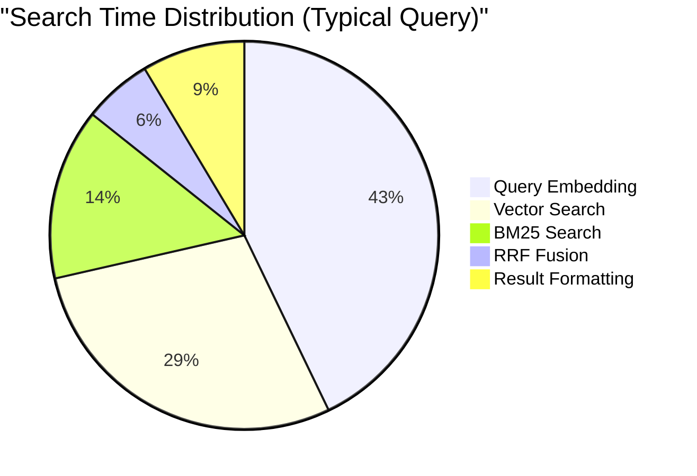

| Component | Time | Notes |
|-----------|------|-------|
| Query embedding | ~15ms | The biggest cost |
| Vector search (HNSW) | ~10ms | Very fast (logarithmic) |
| BM25 search | ~5ms | SQLite FTS5 |
| RRF fusion | ~2ms | In-memory ranking |
| Result formatting | ~3ms | Build response |
| **Total** | **~35ms** | Well under 100ms target |

### Why Query Embedding Dominates

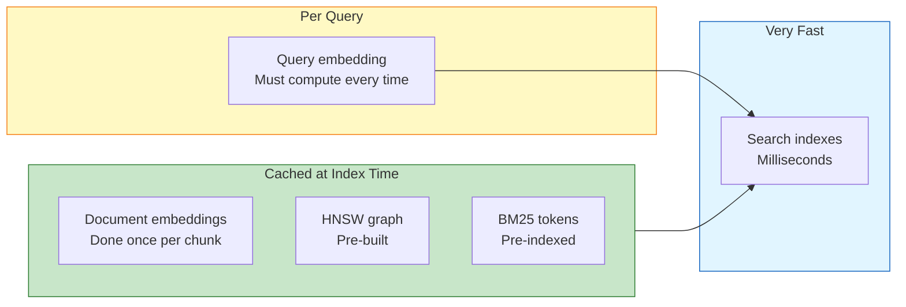

---

## What's Cached

### 1. Document Embeddings

**When:** At index time
**What:** 768-float vector for each chunk
**Why:** Embedding is expensive (~20ms per chunk)

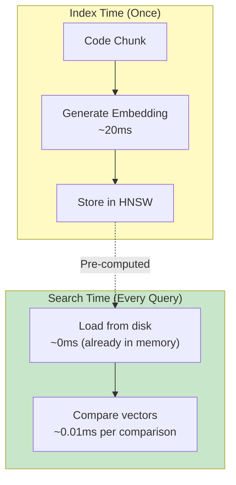

**Cost without caching:** 20,000 chunks × 20ms = 400 seconds per search!
**Cost with caching:** 0ms (vectors already computed)

### 2. HNSW Index

**When:** At index time
**What:** Navigable graph connecting similar vectors
**Why:** Makes search O(log N) instead of O(N)

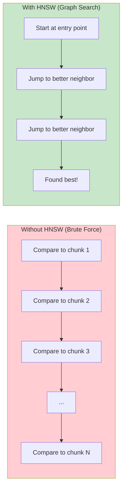

| Chunks | Brute Force | HNSW |
|--------|-------------|------|
| 1,000 | 1,000 comparisons | ~10 comparisons |
| 10,000 | 10,000 comparisons | ~15 comparisons |
| 100,000 | 100,000 comparisons | ~20 comparisons |

### 3. BM25 Index (SQLite FTS5)

**When:** At index time
**What:** Inverted index of tokens → documents
**Why:** Instant keyword lookup

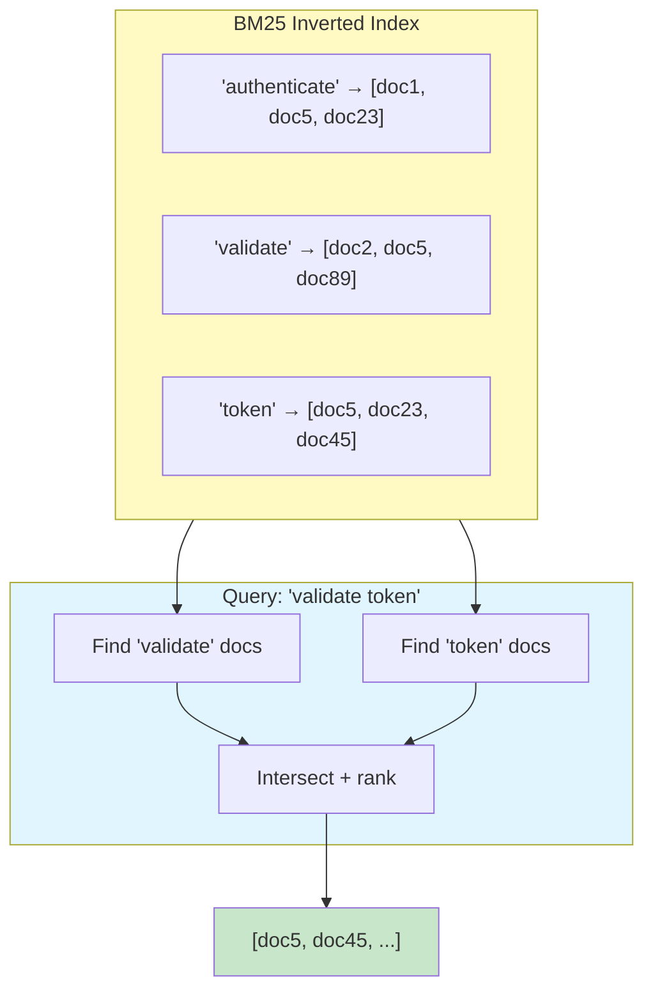

---

## Memory Architecture

### What Lives Where

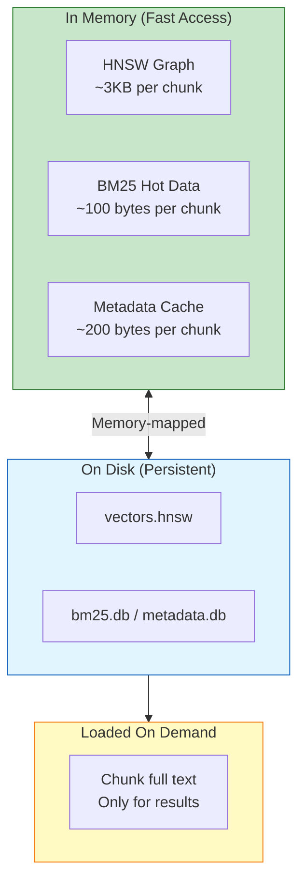

### Memory Calculation

For a 100,000 chunk index:

| Component | Per Chunk | Total |
|-----------|-----------|-------|
| HNSW vectors (768 × 4 bytes) | 3 KB | 300 MB |
| HNSW graph structure | 200 bytes | 20 MB |
| Metadata cache | 200 bytes | 20 MB |
| **Total** | ~3.4 KB | **~340 MB** |

Most codebases have 10K-50K chunks, so typical usage is 100-200 MB.

---

## Incremental Updates

### The Problem

Re-indexing everything when one file changes would be slow:
- 10,000 files × 5ms parse = 50 seconds
- 50,000 chunks × 20ms embed = 1000 seconds

### The Solution

Only process what changed:

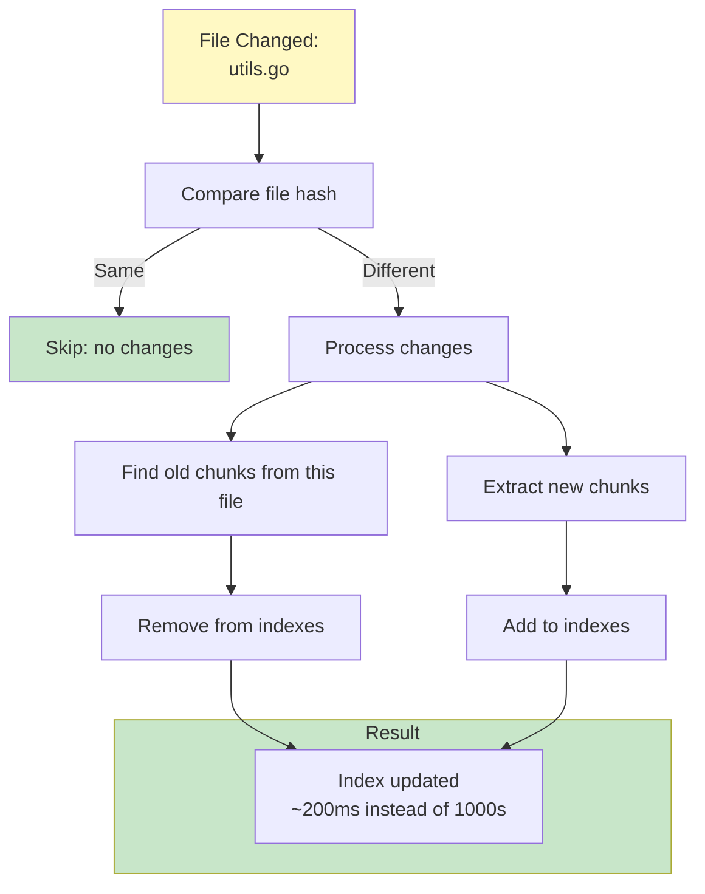

### What Gets Reused

| Scenario | Reused | Re-computed |
|----------|--------|-------------|
| File unchanged | Everything | Nothing |
| One function changed | Other files, other functions in same file | Just that function |
| New file added | All existing | Just new file |
| File deleted | All remaining | Nothing |

---

## Startup Optimization

### Cold Start

First launch loads indexes from disk:

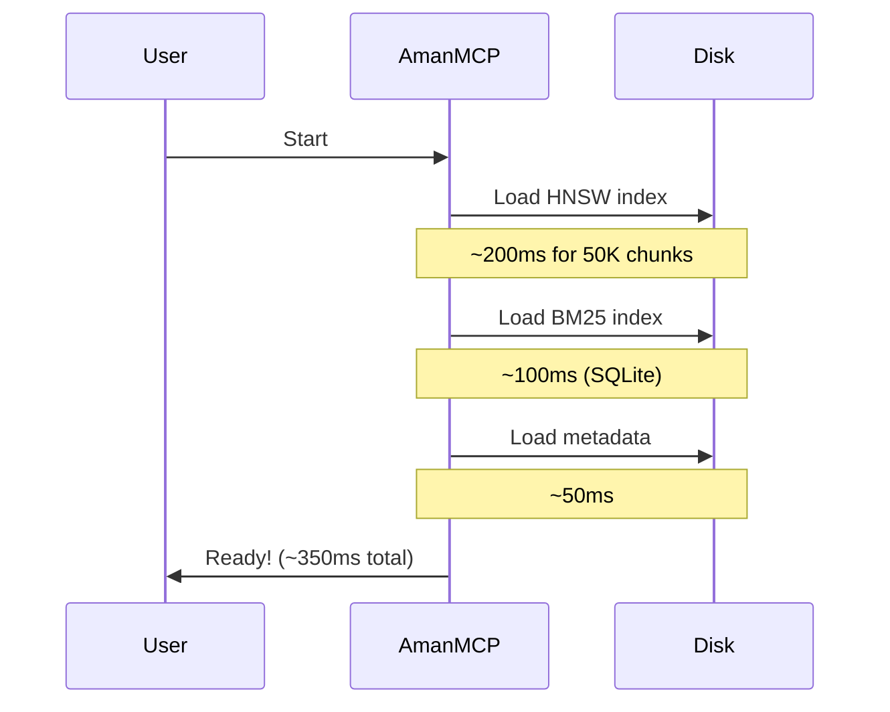

### Warm Queries

After startup, searches are memory-only:

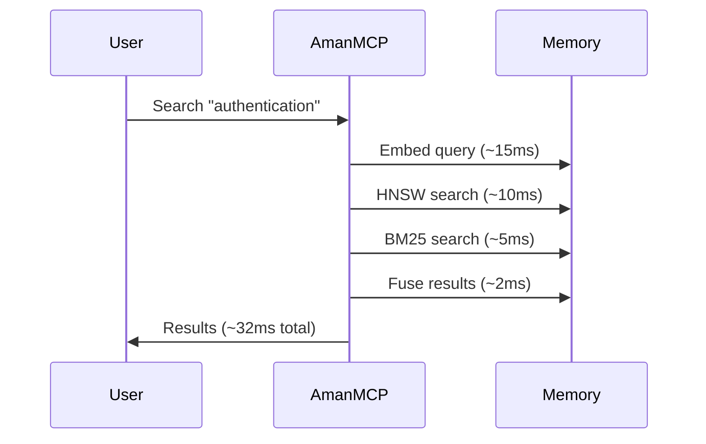

---

## Embedding Provider Performance

### Provider Comparison

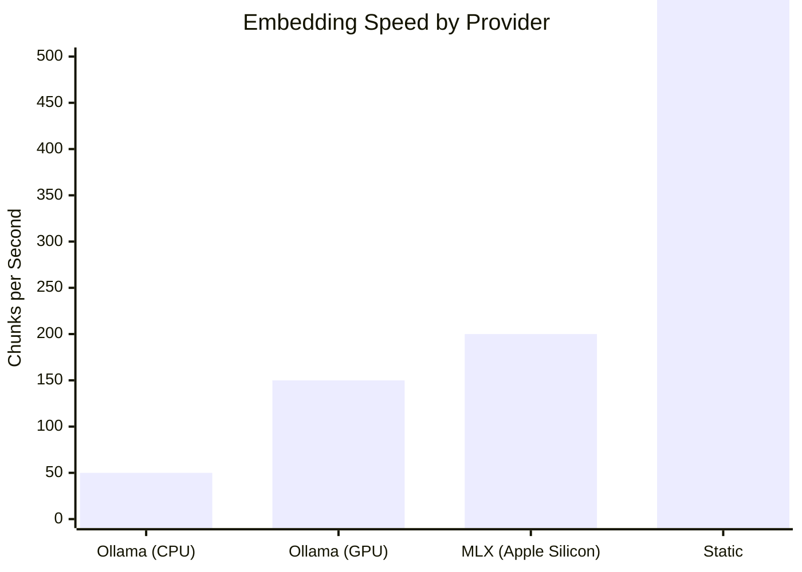

| Provider | Speed | Quality | Best For |
|----------|-------|---------|----------|
| Ollama (CPU) | 50/sec | High | Cross-platform default |
| Ollama (GPU) | 150/sec | High | NVIDIA systems |
| MLX | 200/sec | High | Apple Silicon |
| Static | 10,000/sec | Medium | Offline, instant |

### When Speed Matters

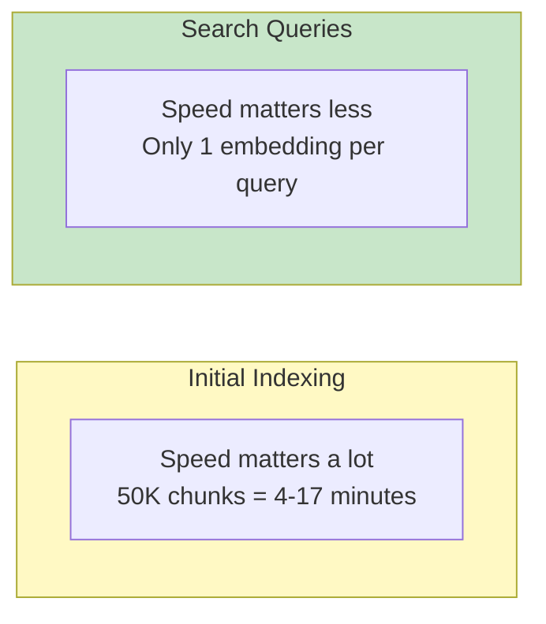

---

## Performance Tuning

### Quick Wins

| Setting | Default | For Speed | For Quality |
|---------|---------|-----------|-------------|
| Embedding batch size | 32 | 64 | 16 |
| HNSW ef_search | 50 | 30 | 100 |
| Result limit | 10 | 5 | 20 |
| BM25 results | 50 | 30 | 100 |

### Configuration

```yaml
# .amanmcp.yaml
performance:
  # Embedding batching
  embedding_batch_size: 32

  # HNSW search parameters
  ef_search: 50  # Lower = faster, higher = better recall

  # Candidate pool sizes
  bm25_candidates: 50
  vector_candidates: 50

  # Memory limits
  max_memory_mb: 300
```

### When to Tune

| Symptom | Cause | Fix |
|---------|-------|-----|
| Search > 100ms | Large index, ef too high | Lower ef_search |
| Missing results | ef too low | Raise ef_search |
| High memory | Large index | Increase max_memory_mb or reduce candidates |
| Slow indexing | CPU embeddings | Switch to MLX (Mac) or Ollama GPU |

---

## Monitoring Performance

### Built-in Metrics

```bash
# Check index stats
amanmcp status

# Output:
# Index size: 45 MB (disk), 180 MB (memory)
# Chunks: 12,345
# Average search time: 28ms
# Cache hit rate: 94%
```

### Verbose Timing

```bash
amanmcp search "query" --timing

# Output:
# Query embedding: 14ms
# BM25 search: 4ms
# Vector search: 8ms
# RRF fusion: 2ms
# Formatting: 3ms
# Total: 31ms
```

---

## Performance Summary

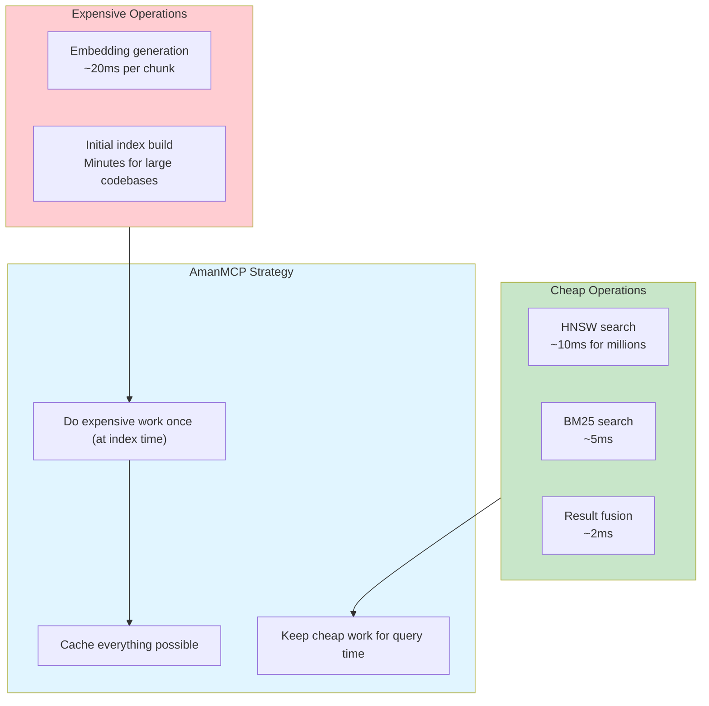

---

## Next Steps

| Want to... | Read |
|------------|------|
| Understand the indexing process | [Indexing Pipeline](indexing-pipeline.md) |
| Configure for your system | [Configuration Guide](../reference/configuration.md) |
| Optimize search quality | [Understanding Results](../tutorials/understanding-results.md) |

---

*Fast search is achieved by doing expensive work once and caching aggressively. AmanMCP indexes once, searches instantly.*
