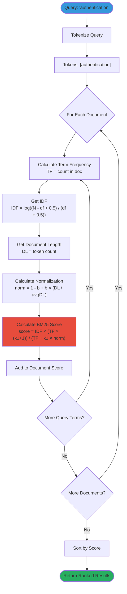
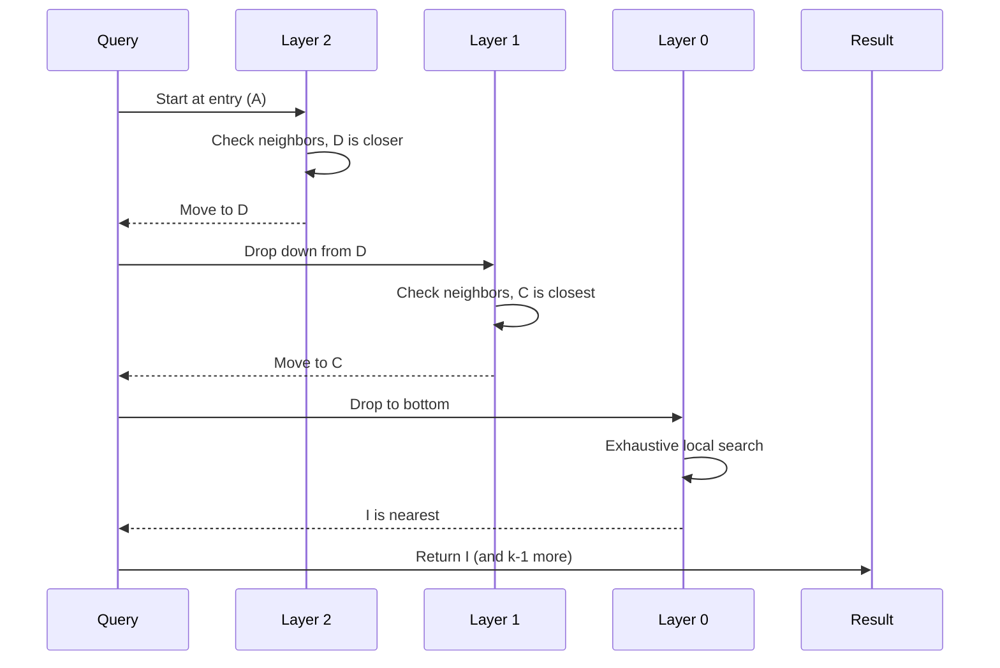
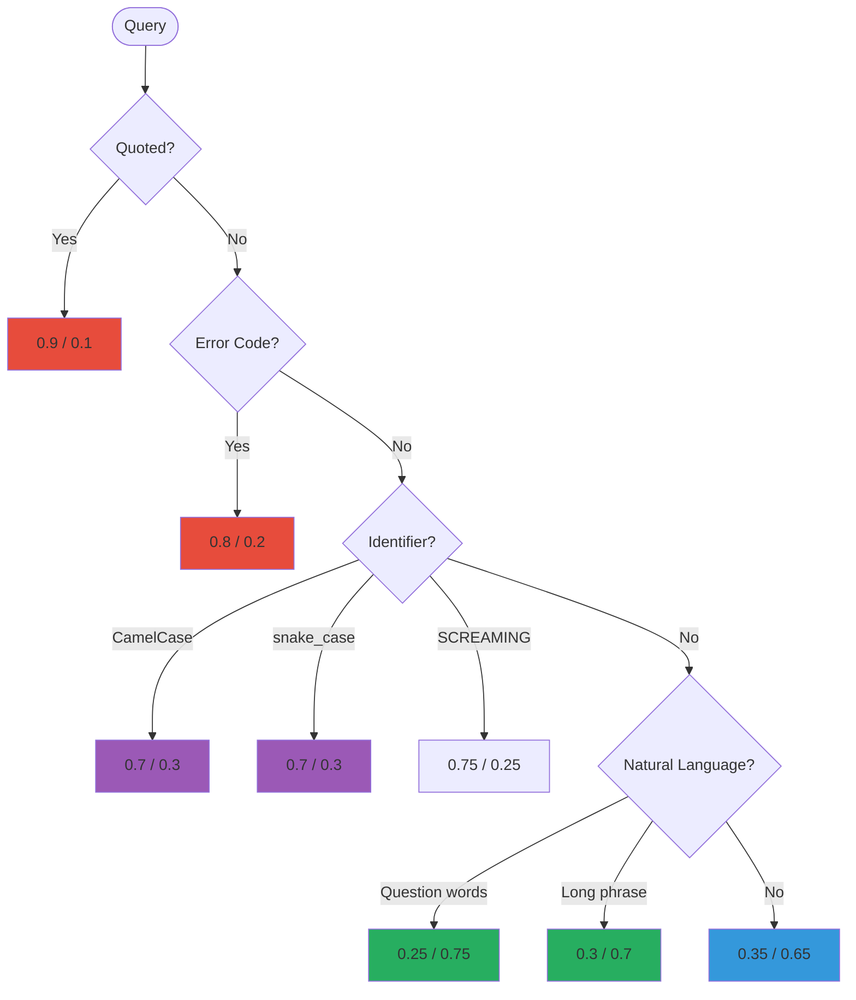
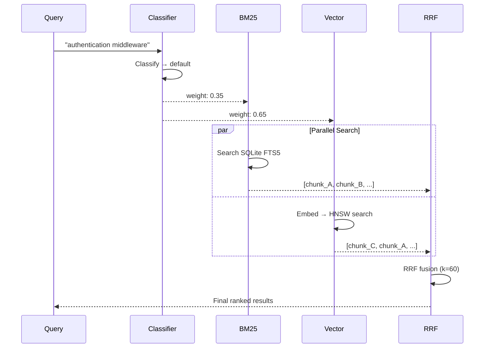

# Hybrid Search: Advanced

Algorithms, formulas, and implementation details for hybrid search.

**Reading time:** 15 minutes
**Audience:** Developers, contributors
**Prerequisites:** [Overview](overview.md), [How It Works](how-it-works.md)

---

## Quick Summary

- BM25 uses term frequency, inverse document frequency, and length normalization
- Vector search uses HNSW for O(log n) nearest neighbor search
- RRF combines rankings with `score = Σ weight_i / (k + rank_i)`
- Query classification uses pattern matching to adjust weights

---

## BM25 Algorithm

### The Formula

```
BM25(D, Q) = Σ IDF(qi) × (f(qi, D) × (k1 + 1)) / (f(qi, D) + k1 × (1 - b + b × |D|/avgdl))

Where:
  Q = query terms [q1, q2, ...]
  D = document
  f(qi, D) = frequency of term qi in document D
  |D| = document length (in tokens)
  avgdl = average document length
  k1 = 1.2 (term frequency saturation)
  b = 0.75 (length normalization strength)
```

### IDF (Inverse Document Frequency)

Rare terms get higher weight:

```
IDF(qi) = log((N - n(qi) + 0.5) / (n(qi) + 0.5))

Where:
  N = total number of documents
  n(qi) = number of documents containing term qi
```

**Intuition:** If a term appears in 1 out of 1000 documents, it's highly specific. If it appears in 900 out of 1000, it's nearly meaningless.

### Length Normalization

The `b` parameter controls how much document length matters:

```
b = 0: Document length ignored
b = 1: Full length normalization
b = 0.75: Default - moderate normalization
```

**Why?** A long document might contain your term by chance. Short documents with the term are more focused.

### BM25 Algorithm Flowchart



### Go Implementation

```go
type BM25Index struct {
    documents map[string][]string  // docID -> tokens
    idf       map[string]float64   // term -> IDF score
    avgLen    float64              // average doc length
    k1        float64              // default: 1.2
    b         float64              // default: 0.75
}

func (idx *BM25Index) Score(query string, docID string) float64 {
    tokens := tokenize(query)
    docTokens := idx.documents[docID]
    docLen := float64(len(docTokens))

    var score float64
    for _, term := range tokens {
        tf := countOccurrences(term, docTokens)
        idf := idx.idf[term]

        // BM25 formula
        numerator := tf * (idx.k1 + 1)
        denominator := tf + idx.k1*(1-idx.b+idx.b*docLen/idx.avgLen)
        score += idf * numerator / denominator
    }
    return score
}
```

---

## Vector Search Algorithm

### Embedding Generation

Text → Neural Network → Vector (768 dimensions)

```go
func (e *Embedder) Embed(text string) ([]float32, error) {
    // Tokenize
    tokens := e.tokenizer.Encode(text)

    // Run through transformer model
    output := e.model.Forward(tokens)

    // Pool to single vector (mean pooling)
    embedding := meanPool(output)

    // Normalize for cosine similarity
    return normalize(embedding), nil
}
```

### Cosine Similarity

Measures angle between vectors:

```
cosine_similarity(A, B) = (A · B) / (|A| × |B|)

Where:
  A · B = Σ(ai × bi)  (dot product)
  |A| = √(Σ ai²)      (magnitude)
```

**Range:** -1 to 1 (for text, usually 0 to 1)
- 1.0 = identical meaning
- 0.0 = unrelated
- < 0 = opposite (rare for text)

### HNSW (Hierarchical Navigable Small Worlds)

HNSW builds a multi-layer graph for O(log n) search instead of O(n) brute force.

**Structure:**

```
Layer 2 (sparse):     A -------- D
                      |          |
Layer 1 (medium):     A -- B -- C -- D
                      |    |    |    |
Layer 0 (dense):      A-B-E-F-C-D-G-H-I-J
```

**Search algorithm:**

1. Start at top layer entry point
2. Greedily move to closer neighbors
3. When stuck, drop to next layer
4. Repeat until bottom layer
5. Return k nearest neighbors



### Go Implementation

```go
import "github.com/coder/hnsw"

type VectorIndex struct {
    graph    *hnsw.Graph[uint64]
    embedder Embedder
}

func (v *VectorIndex) Search(query string, k int) ([]Result, error) {
    // Convert query to vector
    embedding, err := v.embedder.Embed(query)
    if err != nil {
        return nil, fmt.Errorf("embed query: %w", err)
    }

    // Find k nearest neighbors using HNSW
    neighbors := v.graph.Search(embedding, k)

    // Convert to results with scores
    results := make([]Result, len(neighbors))
    for i, n := range neighbors {
        results[i] = Result{
            ID:    n.Key,
            Score: 1 - n.Distance,  // Convert distance to similarity
        }
    }
    return results, nil
}
```

---

## RRF (Reciprocal Rank Fusion)

### The Formula

```
RRF_score(d) = Σ (weight_i / (k + rank_i(d)))

Where:
  d = document
  i = search source (BM25, Vector)
  k = 60 (smoothing constant)
  rank_i(d) = position of d in source i's results (1-indexed)
  weight_i = source weight (BM25: 0.35, Vector: 0.65)
```

### Why k = 60?

The constant k controls how much top ranks dominate:

| k | Rank 1 Score | Rank 10 Score | Effect |
|---|--------------|---------------|--------|
| 10 | 0.091 | 0.050 | Top ranks dominate too much |
| 60 | 0.016 | 0.014 | Smooth decay, all contribute |
| 200 | 0.005 | 0.005 | Ranks barely matter |

k = 60 is empirically validated across search systems.

### Worked Example

```
BM25 results (weight 0.35):      Vector results (weight 0.65):
1. chunk_A                       1. chunk_C
2. chunk_B                       2. chunk_A
3. chunk_C                       3. chunk_D
4. chunk_D                       4. chunk_B

chunk_A:
  BM25: 0.35 / (60 + 1) = 0.00574
  Vec:  0.65 / (60 + 2) = 0.01048
  Total: 0.01622

chunk_B:
  BM25: 0.35 / (60 + 2) = 0.00565
  Vec:  0.65 / (60 + 4) = 0.01016
  Total: 0.01581

chunk_C:
  BM25: 0.35 / (60 + 3) = 0.00556
  Vec:  0.65 / (60 + 1) = 0.01066
  Total: 0.01622

chunk_D:
  BM25: 0.35 / (60 + 4) = 0.00547
  Vec:  0.65 / (60 + 3) = 0.01032
  Total: 0.01579

Final ranking: A ≈ C > B > D
```

### Go Implementation

```go
func RRFFusion(bm25Results, vecResults []Result, bm25Weight, vecWeight float64, k float64) []Result {
    scores := make(map[string]float64)

    // Add BM25 contributions
    for rank, r := range bm25Results {
        scores[r.ID] += bm25Weight / (k + float64(rank+1))
    }

    // Add Vector contributions
    for rank, r := range vecResults {
        scores[r.ID] += vecWeight / (k + float64(rank+1))
    }

    // Sort by combined score
    return sortByScore(scores)
}
```

---

## Query Classification

### Classification Logic

```go
func classifyQuery(query string) (bm25Weight, vecWeight float64) {
    // Quoted exact phrase
    if strings.HasPrefix(query, `"`) && strings.HasSuffix(query, `"`) {
        return 0.9, 0.1
    }

    // Error code pattern (ERR_, E1001, etc.)
    if isErrorCode(query) {
        return 0.8, 0.2
    }

    // Code identifier (CamelCase or snake_case)
    if isCamelCase(query) || isSnakeCase(query) {
        return 0.7, 0.3
    }

    // SCREAMING_SNAKE_CASE (constants)
    if isScreamingSnake(query) {
        return 0.75, 0.25
    }

    // Natural language question
    if containsQuestionWords(query) || wordCount(query) > 5 {
        return 0.25, 0.75
    }

    // Default: slight semantic preference
    return 0.35, 0.65
}

func isErrorCode(s string) bool {
    patterns := []string{
        `^ERR_`,
        `^E\d{3,}`,
        `^ERROR_`,
    }
    for _, p := range patterns {
        if matched, _ := regexp.MatchString(p, s); matched {
            return true
        }
    }
    return false
}

func isCamelCase(s string) bool {
    return regexp.MustCompile(`^[a-z]+[A-Z]`).MatchString(s)
}

func isSnakeCase(s string) bool {
    return strings.Contains(s, "_") && s == strings.ToLower(s)
}
```

### Classification Decision Tree



---

## Full Search Pipeline

### Architecture

```
internal/search/
├── engine.go      # Coordinates hybrid search
├── bm25.go        # BM25 implementation (uses SQLite FTS5)
├── vector.go      # Vector search wrapper (uses coder/hnsw)
├── fusion.go      # RRF implementation
└── classifier.go  # Query classification
```

### Sequence Diagram



### Code

```go
func (e *Engine) Search(ctx context.Context, query string, limit int) ([]Result, error) {
    // 1. Classify query
    bm25Weight, vecWeight := classifyQuery(query)

    // 2. Run searches in parallel
    var wg sync.WaitGroup
    var bm25Results, vecResults []Result
    var bm25Err, vecErr error

    wg.Add(2)
    go func() {
        defer wg.Done()
        bm25Results, bm25Err = e.bm25.Search(ctx, query, limit*2)
    }()
    go func() {
        defer wg.Done()
        vecResults, vecErr = e.vector.Search(ctx, query, limit*2)
    }()
    wg.Wait()

    if bm25Err != nil {
        return nil, fmt.Errorf("bm25 search: %w", bm25Err)
    }
    if vecErr != nil {
        return nil, fmt.Errorf("vector search: %w", vecErr)
    }

    // 3. Fuse results
    combined := RRFFusion(bm25Results, vecResults, bm25Weight, vecWeight, 60)

    // 4. Return top results
    if len(combined) > limit {
        combined = combined[:limit]
    }
    return combined, nil
}
```

---

## Performance Characteristics

### Latency Breakdown

| Component | Target | Actual (100K chunks) |
|-----------|--------|----------------------|
| Query classification | < 1ms | ~0.5ms |
| BM25 (SQLite FTS5) | < 10ms | 2-5ms |
| Vector (HNSW) | < 15ms | 5-10ms |
| RRF fusion | < 1ms | ~0.3ms |
| **Total** | **< 20ms** | **8-15ms** |

### Scaling

| Chunks | BM25 | Vector (HNSW) |
|--------|------|---------------|
| 10K | < 2ms | < 2ms |
| 100K | < 5ms | < 10ms |
| 300K | < 15ms | < 15ms |

Both scale well. BM25 uses SQLite FTS5's optimized inverted index. Vector uses HNSW's O(log n) graph search.

---

## Common Mistakes

### 1. Sequential Execution

```go
// BAD: Sequential (slow)
bm25Results := bm25.Search(query)
vecResults := vector.Search(query)  // Waits for BM25

// GOOD: Parallel (fast)
var wg sync.WaitGroup
wg.Add(2)
go func() { bm25Results = bm25.Search(query); wg.Done() }()
go func() { vecResults = vector.Search(query); wg.Done() }()
wg.Wait()
```

### 2. Fixed Weights

```go
// BAD: Always same weights
return fusion(bm25, vector, 0.5, 0.5)

// GOOD: Query-dependent weights
weights := classify(query)
return fusion(bm25, vector, weights.BM25, weights.Vector)
```

### 3. Not Handling Empty Results

```go
// BAD: Assumes results exist
func handleSearch(query string) Result {
    results := engine.Search(query, 10)
    return results[0]  // Panic if empty!
}

// GOOD: Check length
func handleSearch(query string) (Result, error) {
    results := engine.Search(query, 10)
    if len(results) == 0 {
        return Result{}, ErrNoResults
    }
    return results[0], nil
}
```

---

## Further Reading

- [BM25 Wikipedia](https://en.wikipedia.org/wiki/Okapi_BM25) - Original algorithm
- [HNSW Paper](https://arxiv.org/abs/1603.09320) - Vector search algorithm
- [RRF Paper](https://plg.uwaterloo.ca/~gvcormac/cormacksigir09-rrf.pdf) - Fusion technique
- [coder/hnsw](https://github.com/coder/hnsw) - Pure Go HNSW implementation

---

*For the intuitive explanation, see [How It Works](how-it-works.md).*
