# Indexing Pipeline

How code goes from files on disk to a searchable index.

**Reading time:** 8 minutes
**Audience:** Users who want to understand how indexing works
**Prerequisites:** None (but [Tree-sitter Overview](tree-sitter/overview.md) helps)

---

## Quick Summary

- **Scanning** discovers files (respects .gitignore)
- **Parsing** extracts code structure (tree-sitter)
- **Chunking** creates searchable units (functions, types)
- **Embedding** converts chunks to vectors (Ollama/MLX)
- **Storing** saves to BM25 + HNSW indexes

---

## The Big Picture

```mermaid
flowchart TB
    subgraph Input["Your Codebase"]
        Files["📁 Source Files<br/>main.go, utils.py, etc."]
    end

    subgraph Pipeline["Indexing Pipeline"]
        Scan["1. Scan<br/>Find indexable files"]
        Parse["2. Parse<br/>Tree-sitter AST"]
        Chunk["3. Chunk<br/>Extract functions, types"]
        Embed["4. Embed<br/>Generate vectors"]
        Store["5. Store<br/>BM25 + HNSW"]
    end

    subgraph Output["Search Indexes"]
        BM25["BM25 Index<br/>(keywords)"]
        HNSW["HNSW Index<br/>(vectors)"]
        Meta["Metadata<br/>(file paths, lines)"]
    end

    Files --> Scan --> Parse --> Chunk --> Embed --> Store
    Store --> BM25
    Store --> HNSW
    Store --> Meta

    style Input fill:#e3f2fd,stroke:#1565c0
    style Pipeline fill:#fff8e1,stroke:#ff8f00
    style Output fill:#c8e6c9,stroke:#2e7d32
```



---

## Stage 1: File Scanning

### What Happens

The scanner walks your project directory, finding files to index.

```mermaid
flowchart TB
    Root["Project Root<br/>/myproject"]

    Root --> Discover["Walk Directory Tree"]

    Discover --> Check{For Each File}

    Check -->|"In .gitignore?"| Skip1["❌ Skip"]
    Check -->|"In .amanmcp ignore?"| Skip2["❌ Skip"]
    Check -->|"Binary file?"| Skip3["❌ Skip"]
    Check -->|"Too large?"| Skip4["❌ Skip"]
    Check -->|"Supported language?"| Queue["✅ Queue for indexing"]

    Queue --> FileList["File List<br/>main.go, utils.py, config.ts, ..."]

    style Root fill:#e1f5ff
    style Queue fill:#c8e6c9
    style Skip1 fill:#ffcdd2
    style Skip2 fill:#ffcdd2
    style Skip3 fill:#ffcdd2
    style Skip4 fill:#ffcdd2
```



### Exclusion Rules

Files are excluded based on:

| Rule | Source | Example |
|------|--------|---------|
| Git ignores | `.gitignore` | `node_modules/`, `*.log` |
| AmanMCP config | `.amanmcp.yaml` | Custom patterns |
| Binary detection | Content inspection | Images, compiled files |
| Size limits | Default 1MB | Very large files |
| Hidden files | Convention | `.git/`, `.env` |

### Default Exclusions

```yaml
# Always excluded
- .git/
- node_modules/
- vendor/
- __pycache__/
- *.exe, *.dll, *.so
- *.jpg, *.png, *.gif
- *.zip, *.tar.gz
```

---

## Stage 2: Parsing

### What Happens

Each file is parsed into a syntax tree using tree-sitter.

```mermaid
flowchart LR
    subgraph Input["Source File"]
        Code["func Add(a, b int) int {<br/>    return a + b<br/>}"]
    end

    subgraph Detection["Language Detection"]
        Ext["Extension: .go"]
        Grammar["Load Go grammar"]
    end

    subgraph Parsing["Tree-sitter"]
        Parse["Parse to AST"]
    end

    subgraph Output["Syntax Tree"]
        Tree["function_declaration<br/>├── name: Add<br/>├── params: (a, b int)<br/>└── body: { return a + b }"]
    end

    Code --> Ext --> Grammar --> Parse --> Tree

    style Input fill:#e1f5ff
    style Detection fill:#fff9c4
    style Parsing fill:#ffcc80
    style Output fill:#c8e6c9
```



### Language Support

| Language | Extensions | Parser |
|----------|------------|--------|
| Go | `.go` | tree-sitter-go |
| Python | `.py` | tree-sitter-python |
| TypeScript | `.ts`, `.tsx` | tree-sitter-typescript |
| JavaScript | `.js`, `.jsx` | tree-sitter-javascript |
| Rust | `.rs` | tree-sitter-rust |
| Java | `.java` | tree-sitter-java |
| Markdown | `.md` | tree-sitter-markdown |

Unsupported files fall back to line-based chunking.

---

## Stage 3: Chunking

### What Happens

The syntax tree is walked to extract meaningful code units.

```mermaid
flowchart TB
    Tree["Syntax Tree"]

    Tree --> Walk["Walk Tree (Depth-First)"]

    Walk --> Node{Node Type?}

    Node -->|function_declaration| Extract1["✅ Extract as chunk"]
    Node -->|method_declaration| Extract2["✅ Extract as chunk"]
    Node -->|type_declaration| Extract3["✅ Extract as chunk"]
    Node -->|import_statement| Skip["⏭️ Skip (not a chunk)"]
    Node -->|other| Skip

    Extract1 --> Chunks["Chunk List"]
    Extract2 --> Chunks
    Extract3 --> Chunks

    subgraph ChunkData["Each Chunk Contains"]
        Content["Content (full code)"]
        Path["File path"]
        Lines["Start/End lines"]
        Sig["Signature"]
        Doc["Doc comment"]
    end

    Chunks --> ChunkData

    style Tree fill:#e1f5ff
    style Extract1 fill:#c8e6c9
    style Extract2 fill:#c8e6c9
    style Extract3 fill:#c8e6c9
    style Skip fill:#fff9c4
```



### What Gets Chunked

| Language | Chunk Types |
|----------|-------------|
| **Go** | Functions, methods, types, constants |
| **Python** | Functions, classes, methods |
| **TypeScript** | Functions, classes, interfaces, types |
| **Rust** | Functions, impls, structs, enums, traits |

### Chunk Size Considerations

```mermaid
graph LR
    subgraph TooSmall["Too Small"]
        Small["Single variable<br/>line 1-1<br/>❌ No context"]
    end

    subgraph JustRight["Just Right"]
        Good["Complete function<br/>lines 10-45<br/>✅ Self-contained"]
    end

    subgraph TooLarge["Too Large"]
        Large["Entire file<br/>lines 1-2000<br/>❌ Diluted meaning"]
    end

    style TooSmall fill:#ffcdd2
    style JustRight fill:#c8e6c9
    style TooLarge fill:#ffcdd2
```



AmanMCP targets **complete semantic units** - whole functions, not fragments.

---

## Stage 4: Embedding

### What Happens

Each chunk is converted to a numerical vector that captures its meaning.


### Embedding Providers

| Provider | Model | Speed | Use Case |
|----------|-------|-------|----------|
| **Ollama** | nomic-embed-text | Fast | Default, cross-platform |
| **MLX** | nomic-embed-text | Faster | Apple Silicon optimization |
| **Static** | Word vectors | Instant | Offline fallback |

### Batching for Efficiency


---

## Stage 5: Storage

### What Happens

Chunks and their vectors are stored in multiple indexes.


### What's Stored Where

| Store | Contents | Purpose |
|-------|----------|---------|
| **BM25** | Chunk text, tokenized | Keyword search |
| **HNSW** | Embedding vectors | Semantic search |
| **Metadata** | File paths, line numbers, signatures | Result display |

### Index Location

```
.amanmcp/
├── bm25.db         # SQLite FTS5 index
├── vectors.hnsw    # HNSW vector index
├── metadata.db     # Chunk metadata
└── config.yaml     # Index configuration
```

---

## Complete Flow Diagram


---

## Incremental Indexing

When files change, only affected parts are re-indexed:


**Benefits:**
- Fast updates (seconds, not minutes)
- No need to re-embed unchanged code
- Maintains index consistency

---

## Performance Characteristics

| Stage | Typical Time | Bottleneck |
|-------|--------------|------------|
| Scanning | ~100ms for 10K files | Disk I/O |
| Parsing | ~5ms per file | CPU |
| Chunking | ~1ms per file | CPU |
| Embedding | ~20ms per chunk | GPU/CPU |
| Storage | ~1ms per chunk | Disk I/O |

**Embedding is the slowest stage** - this is why batching and caching matter.

### Typical Index Times

| Codebase Size | Files | Chunks | Index Time |
|---------------|-------|--------|------------|
| Small (10K LOC) | 50 | 200 | ~10 seconds |
| Medium (100K LOC) | 500 | 2,000 | ~2 minutes |
| Large (1M LOC) | 5,000 | 20,000 | ~20 minutes |

---

## Monitoring Indexing

### Check Status

```bash
# View index status
amanmcp status

# Output:
# Indexed files: 1,234
# Total chunks: 5,678
# Index size: 45 MB
# Last indexed: 2 minutes ago
```

### Watch Progress

```bash
# Index with progress
amanmcp index --verbose

# Output:
# Scanning... 1,234 files found
# Parsing... 500/1,234 (40%)
# Embedding... 2,500/5,678 chunks (44%)
# Storing... done
# Index complete in 2m 15s
```

---

## Next Steps

| Want to... | Read |
|------------|------|
| Understand tree-sitter parsing | [Tree-sitter Overview](tree-sitter/overview.md) |
| Learn how search uses the index | [Hybrid Search](hybrid-search/) |
| See caching strategies | [Caching & Performance](caching-performance.md) |
| Configure exclusions | [Configuration Guide](../reference/configuration.md) |

---

*The indexing pipeline transforms your codebase into a searchable knowledge base. Good indexing enables good search.*
