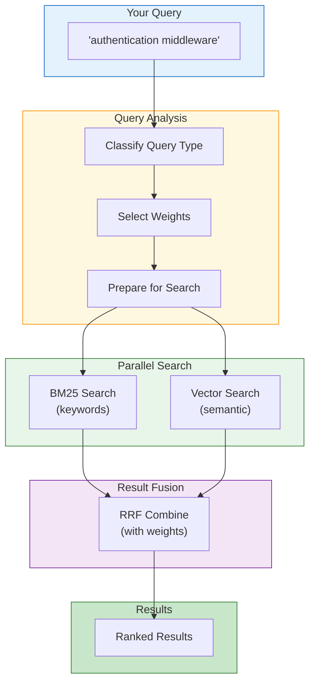
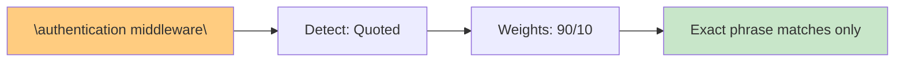
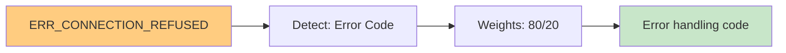
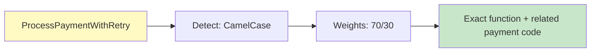
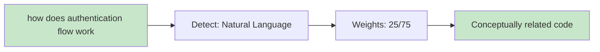
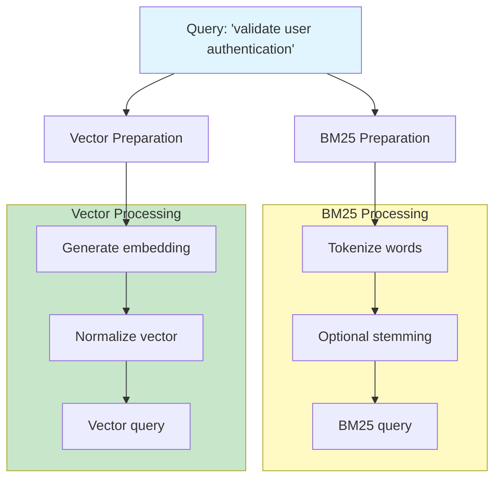
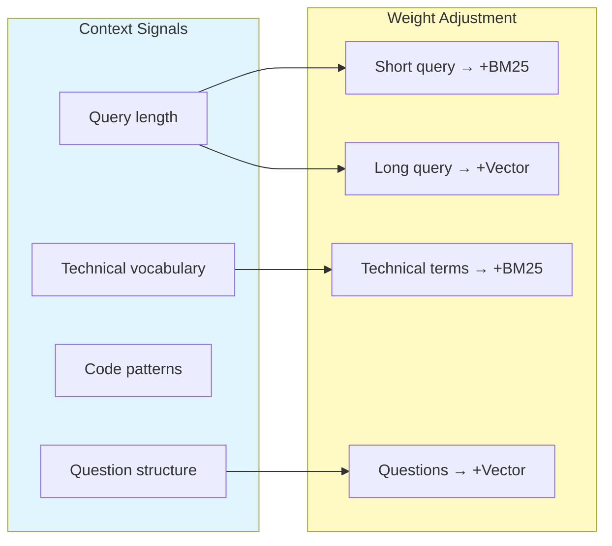
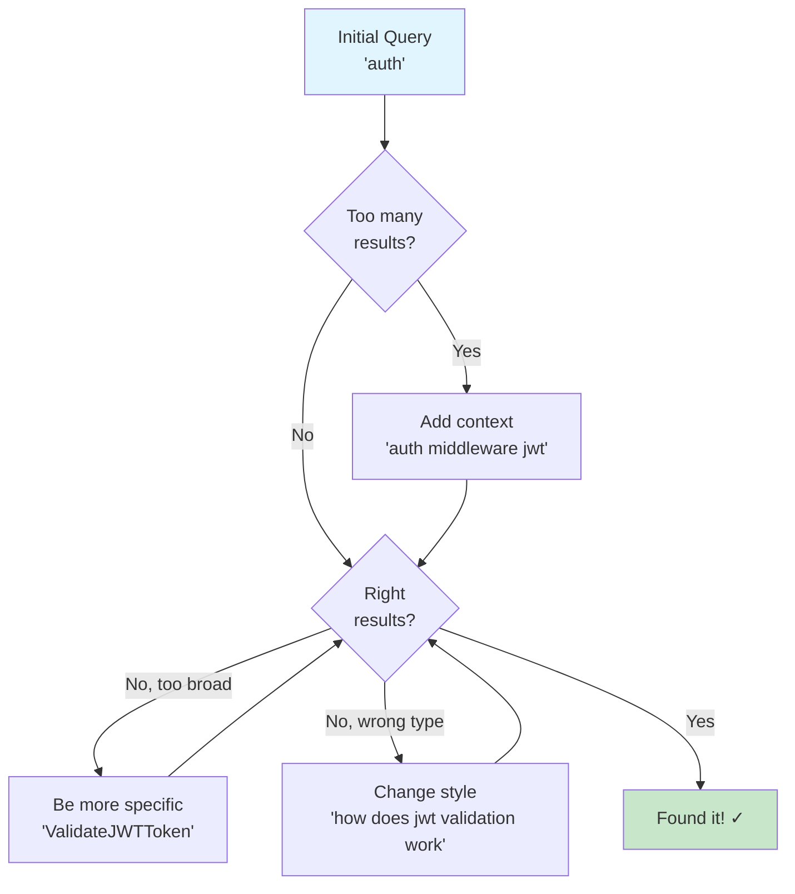

# Query Processing

How AmanMCP analyzes your search query and chooses the best search strategy.

**Reading time:** 6 minutes
**Audience:** Users who want to understand query behavior
**Prerequisites:** [Hybrid Search Overview](hybrid-search/overview.md)

---

## Quick Summary

- Queries are **classified** by type (exact identifier, natural language, etc.)
- Classification determines **BM25/Vector weights**
- Quoted phrases use **exact matching**
- Natural language queries favor **semantic search**

---

## The Query Processing Flow



---

## Query Classification

AmanMCP analyzes your query to determine what type of search will work best.

### Classification Rules

```mermaid
flowchart TB
    Query["Input Query"] --> Check1{Quoted?<br/>'\"exact phrase\"'}

    Check1 -->|Yes| Quoted["QUOTED PHRASE<br/>BM25: 90%, Vector: 10%"]

    Check1 -->|No| Check2{Error code?<br/>ERR_XXX, E1001}

    Check2 -->|Yes| ErrorCode["ERROR CODE<br/>BM25: 80%, Vector: 20%"]

    Check2 -->|No| Check3{CamelCase?<br/>ProcessPayment}

    Check3 -->|Yes| Identifier["IDENTIFIER<br/>BM25: 70%, Vector: 30%"]

    Check3 -->|No| Check4{snake_case?<br/>process_payment}

    Check4 -->|Yes| Identifier

    Check4 -->|No| Check5{Natural language?<br/>how does X work}

    Check5 -->|Yes| Natural["NATURAL LANGUAGE<br/>BM25: 25%, Vector: 75%"]

    Check5 -->|No| Default["DEFAULT<br/>BM25: 35%, Vector: 65%"]

    style Quoted fill:#ffcc80
    style ErrorCode fill:#ffcc80
    style Identifier fill:#fff9c4
    style Natural fill:#c8e6c9
    style Default fill:#e1f5ff
```

### Weight Table

| Query Pattern | BM25 Weight | Vector Weight | Example |
|---------------|-------------|---------------|---------|
| Quoted phrase | 90% | 10% | `"exact match"` |
| Error code | 80% | 20% | `ERR_AUTH_FAILED` |
| CamelCase | 70% | 30% | `ValidateToken` |
| snake_case | 70% | 30% | `validate_token` |
| Path-like | 70% | 30% | `internal/auth` |
| Natural language | 25% | 75% | "how does auth work" |
| **Default** | 35% | 65% | Most queries |

---

## Classification Patterns

### 1. Quoted Phrases

```
Query: "authentication middleware"

Detection: Surrounded by quotes
Strategy: Nearly pure BM25 (exact match)
Why: User explicitly wants exact phrase

Result: Only chunks containing exactly "authentication middleware"
```



### 2. Error Codes

```
Query: ERR_CONNECTION_REFUSED

Detection: Matches pattern [A-Z]+_[A-Z0-9_]+ or E[0-9]+
Strategy: Heavy BM25
Why: Error codes are literal strings

Result: Finds exact error code definitions/handlers
```



### 3. Code Identifiers

```
Query: ProcessPaymentWithRetry

Detection: CamelCase or snake_case pattern
Strategy: Keyword-heavy with some semantic
Why: Likely searching for specific function/type

Result: Finds exact function + semantically related
```



### 4. Natural Language

```
Query: how does the authentication flow work

Detection: Question words, multiple common words
Strategy: Heavy semantic search
Why: User is exploring concepts, not exact code

Result: Auth-related code even with different terminology
```



---

## Detection Patterns in Detail

### CamelCase Detection

```go
// Matches CamelCase identifiers
pattern: [A-Z][a-z]+([A-Z][a-z0-9]+)+

Examples that match:
- ProcessPayment     ✓
- ValidateUserInput  ✓
- HTTPServer         ✓

Examples that don't match:
- process_payment    ✗ (snake_case, different pattern)
- CONSTANT          ✗ (all caps)
- lowercase         ✗ (no caps)
```

### Natural Language Detection

```go
// Heuristics for natural language
signals:
- Starts with question word: "how", "what", "where", "why"
- Contains common words: "the", "does", "is", "work"
- Multiple words without code patterns
- No quotes, no special characters

Examples that match:
- "how does caching work"           ✓
- "where is auth handled"           ✓
- "error handling patterns"         ✓

Examples that don't match:
- "ValidateToken"                   ✗ (identifier)
- "\"exact phrase\""                ✗ (quoted)
- "ERR_AUTH_001"                    ✗ (error code)
```

---

## Query Preparation

After classification, the query is prepared for both search systems:



### BM25 Preparation

1. **Tokenization** - Split into words
2. **Case normalization** - Lower case for matching
3. **Stop word handling** - Keep technical terms
4. **Query construction** - Build FTS5 query

### Vector Preparation

1. **Embedding** - Convert query to 768-dim vector
2. **Normalization** - Unit length for cosine similarity
3. **Query construction** - Set up HNSW search parameters

---

## Dynamic Weight Adjustment

### Context-Aware Weights

The classifier can adjust weights based on context:



### Examples

| Query | Signals | Final Weights |
|-------|---------|---------------|
| `ValidateToken` | Short, CamelCase | BM25: 70%, Vector: 30% |
| `how does token validation work with JWT` | Long, question, technical | BM25: 30%, Vector: 70% |
| `"func ProcessPayment"` | Quoted, identifier | BM25: 90%, Vector: 10% |

---

## Tips for Better Queries

### When to Use What

| Goal | Query Style | Example |
|------|-------------|---------|
| Find exact function | Use the function name | `ProcessPayment` |
| Find by error code | Use exact code | `ERR_AUTH_FAILED` |
| Explore a concept | Use natural language | "how does auth work" |
| Find exact phrase | Quote it | `"validate token"` |
| Find by file path | Include path | `internal/auth handler` |

### Query Refinement



### Common Patterns

```
# Finding implementations
"authentication"           → Semantic: finds auth-related code
"AuthMiddleware"          → Exact: finds specific struct/func

# Finding usage
"how is AuthMiddleware used" → Semantic: finds call sites

# Finding definitions
"func AuthMiddleware"     → Exact: finds definition
"type AuthMiddleware"     → Exact: finds type definition

# Finding related code
"authentication retry"    → Balanced: finds auth + retry logic
```

---

## Debugging Query Classification

### Check How Your Query Was Classified

```bash
# Verbose search shows classification
amanmcp search "your query" --verbose

# Output:
# Query: "your query"
# Classification: NATURAL_LANGUAGE
# Weights: BM25=35%, Vector=65%
# BM25 results: 45
# Vector results: 38
# Fused results: 10
```

### Override Classification

```bash
# Force keyword-heavy search
amanmcp search "auth" --bm25-weight=0.8

# Force semantic-heavy search
amanmcp search "ValidateToken" --vector-weight=0.8

# Pure BM25 (no semantic)
amanmcp search "ERR_AUTH_001" --bm25-only
```

---

## Next Steps

| Want to... | Read |
|------------|------|
| Understand BM25 vs Vector deeply | [Hybrid Search](hybrid-search/) |
| Learn about ranking and scores | [Understanding Results](../tutorials/understanding-results.md) |
| See how caching affects queries | [Caching & Performance](caching-performance.md) |

---

*Smart query processing means you don't have to think about how to search - just search.*
