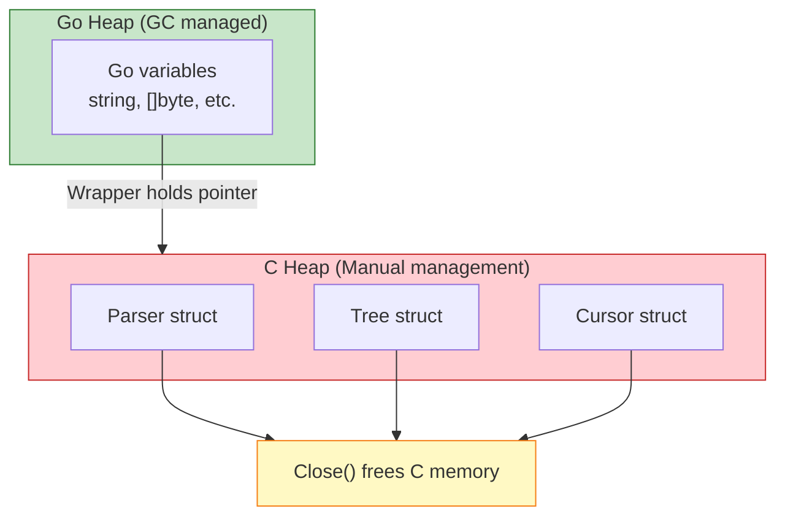
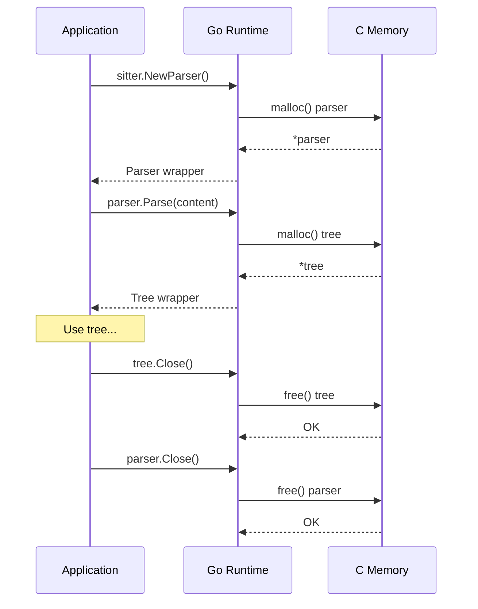
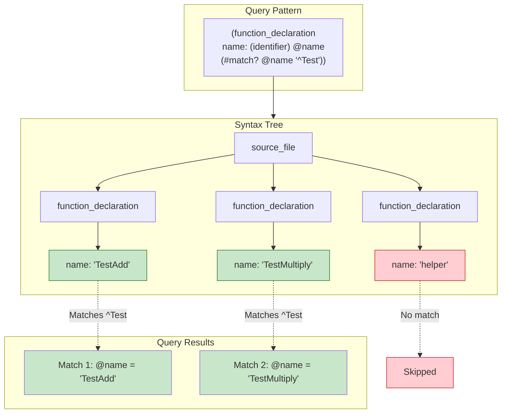
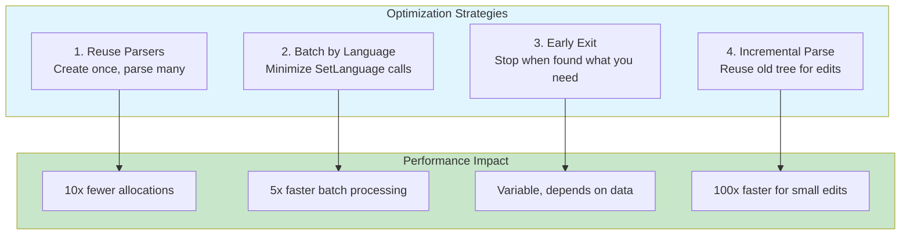
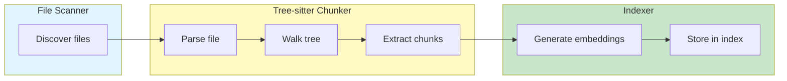

# Tree-sitter: Advanced

Go bindings, memory management, query patterns, and debugging techniques.

**Reading time:** 15 minutes
**Audience:** Developers extending or debugging AmanMCP
**Prerequisites:** [How It Works](how-it-works.md), Go basics

---

## Quick Summary

- Use `go-tree-sitter` bindings with proper resource cleanup
- **Always close** parsers, trees, and cursors (CGO memory)
- Query patterns enable powerful structural matching
- Debug with tree printing and the CLI playground

---

## Go Bindings

### Installation

AmanMCP uses the official Go bindings:

```go
import (
    sitter "github.com/tree-sitter/go-tree-sitter"
    golang "github.com/tree-sitter/tree-sitter-go/bindings/go"
    python "github.com/tree-sitter/tree-sitter-python/bindings/go"
    typescript "github.com/tree-sitter/tree-sitter-typescript/bindings/go"
)
```

### Basic Parsing

```go
func parseGoFile(content []byte) (*sitter.Tree, error) {
    parser := sitter.NewParser()
    defer parser.Close()  // CRITICAL: Must close

    // Set the language
    lang := sitter.NewLanguage(golang.Language())
    parser.SetLanguage(lang)

    // Parse the content
    tree := parser.Parse(content, nil)
    // Caller must call tree.Close() when done

    return tree, nil
}
```

### Multi-Language Support

```go
type Chunker struct {
    parser    *sitter.Parser
    languages map[string]*sitter.Language
}

func NewChunker() *Chunker {
    return &Chunker{
        parser: sitter.NewParser(),
        languages: map[string]*sitter.Language{
            ".go":   sitter.NewLanguage(golang.Language()),
            ".py":   sitter.NewLanguage(python.Language()),
            ".ts":   sitter.NewLanguage(typescript.LanguageTypescript()),
            ".tsx":  sitter.NewLanguage(typescript.LanguageTSX()),
        },
    }
}

func (c *Chunker) Parse(ext string, content []byte) (*sitter.Tree, error) {
    lang, ok := c.languages[ext]
    if !ok {
        return nil, fmt.Errorf("unsupported language: %s", ext)
    }

    c.parser.SetLanguage(lang)
    return c.parser.Parse(content, nil), nil
}

func (c *Chunker) Close() {
    c.parser.Close()
}
```

---

## Memory Management

### The CGO Reality

Tree-sitter is written in C. The Go bindings use CGO, which means:
- Memory is allocated outside Go's garbage collector
- **You must explicitly free resources**
- Forgetting to close = memory leak



### Resource Lifecycle



### The Golden Rules

```go
// Rule 1: Always defer Close() immediately after creation
parser := sitter.NewParser()
defer parser.Close()

tree := parser.Parse(content, nil)
defer tree.Close()

cursor := sitter.NewTreeCursor(tree.RootNode())
defer cursor.Close()

// Rule 2: For batch processing, reuse parsers
func (c *Chunker) ProcessFiles(files []File) []Chunk {
    parser := sitter.NewParser()
    defer parser.Close()  // Once, at the end

    var chunks []Chunk
    for _, file := range files {
        parser.SetLanguage(c.langFor(file.Ext))
        tree := parser.Parse(file.Content, nil)

        chunks = append(chunks, c.extract(tree, file)...)

        tree.Close()  // Close each tree after use
    }
    return chunks
}

// Rule 3: Don't store trees long-term
// BAD: Storing tree in struct that lives forever
type BadCache struct {
    trees map[string]*sitter.Tree  // Memory leak!
}

// GOOD: Store extracted data, not trees
type GoodCache struct {
    chunks map[string][]Chunk  // Extracted Go data
}
```

### Memory Leak Detection

```go
// Debug: Track open resources
var (
    openParsers int64
    openTrees   int64
)

func NewTrackedParser() *sitter.Parser {
    atomic.AddInt64(&openParsers, 1)
    return sitter.NewParser()
}

func CloseTrackedParser(p *sitter.Parser) {
    p.Close()
    atomic.AddInt64(&openParsers, -1)
}

// Log periodically
func logResources() {
    log.Printf("Open parsers: %d, trees: %d",
        atomic.LoadInt64(&openParsers),
        atomic.LoadInt64(&openTrees))
}
```

---

## Tree Walking

### Cursor-Based Traversal

The most efficient way to walk large trees:

```go
func extractChunks(tree *sitter.Tree, source []byte) []Chunk {
    var chunks []Chunk

    cursor := sitter.NewTreeCursor(tree.RootNode())
    defer cursor.Close()

    var walk func()
    walk = func() {
        node := cursor.Node()

        // Check if this is a chunk we want
        if isChunkNode(node.Kind()) {
            chunks = append(chunks, Chunk{
                Type:      node.Kind(),
                Content:   string(source[node.StartByte():node.EndByte()]),
                StartLine: int(node.StartPosition().Row) + 1,
                EndLine:   int(node.EndPosition().Row) + 1,
            })
        }

        // Recurse into children
        if cursor.GoToFirstChild() {
            for {
                walk()
                if !cursor.GoToNextSibling() {
                    break
                }
            }
            cursor.GoToParent()
        }
    }

    walk()
    return chunks
}

func isChunkNode(kind string) bool {
    switch kind {
    case "function_declaration",
         "method_declaration",
         "type_declaration",
         "const_declaration":
        return true
    }
    return false
}
```

### Extracting Specific Fields

```go
// Get function name
func getFunctionName(node *sitter.Node, source []byte) string {
    nameNode := node.ChildByFieldName("name")
    if nameNode == nil {
        return ""
    }
    return string(source[nameNode.StartByte():nameNode.EndByte()])
}

// Get method receiver type
func getReceiverType(node *sitter.Node, source []byte) string {
    receiver := node.ChildByFieldName("receiver")
    if receiver == nil {
        return ""
    }

    // Walk receiver to find type identifier
    for i := uint32(0); i < receiver.ChildCount(); i++ {
        child := receiver.Child(i)
        if child.Kind() == "type_identifier" ||
           child.Kind() == "pointer_type" {
            return string(source[child.StartByte():child.EndByte()])
        }
    }
    return ""
}

// Get doc comment (comment before function)
func getDocComment(node *sitter.Node, source []byte) string {
    prev := node.PrevSibling()
    if prev != nil && prev.Kind() == "comment" {
        return string(source[prev.StartByte():prev.EndByte()])
    }
    return ""
}
```

---

## Query Patterns

Tree-sitter supports S-expression queries for powerful pattern matching:

### Query Syntax

```scheme
; Basic pattern: match function declarations
(function_declaration
  name: (identifier) @func.name)

; Capture multiple parts
(function_declaration
  name: (identifier) @name
  parameters: (parameter_list) @params
  body: (block) @body)

; With predicates (filters)
(function_declaration
  name: (identifier) @name
  (#match? @name "^Test"))  ; Functions starting with "Test"
```

### Using Queries in Go

```go
func findExportedFunctions(tree *sitter.Tree, source []byte, lang *sitter.Language) []string {
    // Query for functions starting with uppercase (exported in Go)
    queryStr := `
        (function_declaration
          name: (identifier) @name
          (#match? @name "^[A-Z]"))
    `

    query, err := sitter.NewQuery(lang, queryStr)
    if err != nil {
        log.Printf("Query error: %v", err)
        return nil
    }
    defer query.Close()

    cursor := sitter.NewQueryCursor()
    defer cursor.Close()

    cursor.Exec(query, tree.RootNode())

    var names []string
    for {
        match, ok := cursor.NextMatch()
        if !ok {
            break
        }

        for _, capture := range match.Captures {
            name := string(source[capture.Node.StartByte():capture.Node.EndByte()])
            names = append(names, name)
        }
    }

    return names
}
```

### Common Query Patterns

```scheme
; Find all error handling
(if_statement
  condition: (binary_expression
    left: (identifier) @err
    operator: "!="
    right: (nil))
  (#eq? @err "err"))

; Find methods on specific type
(method_declaration
  receiver: (parameter_list
    (parameter_declaration
      type: (pointer_type
        (type_identifier) @type)))
  name: (identifier) @method
  (#eq? @type "Server"))

; Find function calls
(call_expression
  function: (identifier) @func)

; Find struct field access
(selector_expression
  operand: (identifier) @object
  field: (field_identifier) @field)
```

### Query Visualization



---

## Error Handling

### Graceful Degradation

```go
func (c *Chunker) ChunkFile(path string, content []byte) ([]Chunk, error) {
    tree := c.parser.Parse(content, nil)
    if tree == nil {
        return nil, fmt.Errorf("parse failed for %s", path)
    }
    defer tree.Close()

    root := tree.RootNode()

    // Check for parse errors
    if root.HasError() {
        // Log but continue - we can still extract valid parts
        log.Printf("Parse errors in %s, extracting valid chunks", path)
    }

    chunks := c.extractChunks(tree, content)

    // Filter out chunks containing errors
    valid := make([]Chunk, 0, len(chunks))
    for _, chunk := range chunks {
        if !c.hasErrorNode(chunk.Node) {
            valid = append(valid, chunk)
        }
    }

    return valid, nil
}

func (c *Chunker) hasErrorNode(node *sitter.Node) bool {
    if node.IsError() || node.IsMissing() {
        return true
    }
    for i := uint32(0); i < node.ChildCount(); i++ {
        if c.hasErrorNode(node.Child(i)) {
            return true
        }
    }
    return false
}
```

### Error Node Types

| Node State | Meaning | How to Detect |
|------------|---------|---------------|
| ERROR | Parser couldn't match grammar | `node.IsError()` |
| MISSING | Expected token not found | `node.IsMissing()` |
| Has Error | Node or descendant has error | `node.HasError()` |

---

## Performance Optimization

### Benchmarks

| Operation | Time | Notes |
|-----------|------|-------|
| Create parser | ~10µs | Reuse when possible |
| Parse 1KB file | ~200µs | Very fast |
| Parse 100KB file | ~5ms | Still fast |
| Tree traversal | ~1µs per node | Cursor is efficient |
| Query execution | ~100µs for simple patterns | Scales with tree size |

### Optimization Strategies



### Incremental Parsing

```go
func (c *Chunker) ParseIncremental(content []byte, oldTree *sitter.Tree, edit InputEdit) *sitter.Tree {
    // Tell parser about the edit
    oldTree.Edit(sitter.InputEdit{
        StartByte:      edit.StartByte,
        OldEndByte:     edit.OldEndByte,
        NewEndByte:     edit.NewEndByte,
        StartPosition:  edit.StartPosition,
        OldEndPosition: edit.OldEndPosition,
        NewEndPosition: edit.NewEndPosition,
    })

    // Parse with old tree - reuses unchanged parts
    return c.parser.Parse(content, oldTree)
}
```

---

## Debugging

### Print Tree Structure

```go
func printTree(node *sitter.Node, source []byte, indent int) {
    prefix := strings.Repeat("  ", indent)

    // Show node kind and content for leaves
    content := ""
    if node.ChildCount() == 0 {
        text := string(source[node.StartByte():node.EndByte()])
        if len(text) > 30 {
            text = text[:30] + "..."
        }
        content = fmt.Sprintf(" = %q", text)
    }

    // Mark error nodes
    errMark := ""
    if node.IsError() {
        errMark = " [ERROR]"
    } else if node.IsMissing() {
        errMark = " [MISSING]"
    }

    fmt.Printf("%s%s%s%s\n", prefix, node.Kind(), content, errMark)

    // Recurse into children
    for i := uint32(0); i < node.ChildCount(); i++ {
        printTree(node.Child(i), source, indent+1)
    }
}

// Usage
tree := parser.Parse(content, nil)
printTree(tree.RootNode(), content, 0)
```

### CLI Tools

```bash
# Install tree-sitter CLI
npm install -g tree-sitter-cli

# Parse a file and show tree
tree-sitter parse main.go

# Interactive playground
tree-sitter playground

# Test queries
tree-sitter query queries/go.scm main.go
```

### Common Issues

| Issue | Cause | Solution |
|-------|-------|----------|
| Memory leak | Forgot Close() | Use defer immediately |
| Wrong tree | Wrong language set | Check extension → language mapping |
| Missing nodes | File has syntax errors | Check HasError(), handle gracefully |
| Slow parsing | Parsing same file repeatedly | Cache results or use incremental |

---

## AmanMCP Implementation

### Chunker Structure

```go
// internal/chunk/chunker.go

type Chunker struct {
    parser    *sitter.Parser
    languages map[string]*sitter.Language
    nodeTypes map[string][]string  // ext → chunk node types
}

func (c *Chunker) ChunkFile(path string, content []byte) ([]Chunk, error) {
    ext := filepath.Ext(path)

    lang, ok := c.languages[ext]
    if !ok {
        return c.chunkPlainText(content), nil
    }

    c.parser.SetLanguage(lang)
    tree := c.parser.Parse(content, nil)
    defer tree.Close()

    return c.extractChunks(tree, content, c.nodeTypes[ext]), nil
}
```

### Integration Points



---

## Further Reading

- [Tree-sitter Documentation](https://tree-sitter.github.io/tree-sitter/)
- [Go Bindings](https://github.com/tree-sitter/go-tree-sitter)
- [Query Syntax](https://tree-sitter.github.io/tree-sitter/using-parsers#query-syntax)
- [Playground](https://tree-sitter.github.io/tree-sitter/playground)

---

## Next Steps

| Want to... | Read |
|------------|------|
| See the full indexing flow | [Indexing Pipeline](../indexing-pipeline.md) |
| Understand search | [Hybrid Search](../hybrid-search/) |
| Learn about chunking strategies | [Two-Stage Retrieval](../two-stage-retrieval.md) |

---

*Tree-sitter is the foundation of intelligent code extraction. Master it, and you master code understanding.*
