# Tree-sitter: How It Works

Understanding parsing, syntax trees, and how AmanMCP extracts code chunks.

**Reading time:** 10 minutes
**Audience:** Users who want to understand the parsing process
**Prerequisites:** [Overview](overview.md)

---

## Quick Summary

- Parsing converts code text into a **structured tree**
- Each tree **node** represents a code element (function, if-statement, etc.)
- Tree-sitter uses **grammars** to know each language's rules
- **Incremental parsing** makes re-indexing fast when files change

---

## The Parsing Process

When tree-sitter parses code, it goes through three stages:

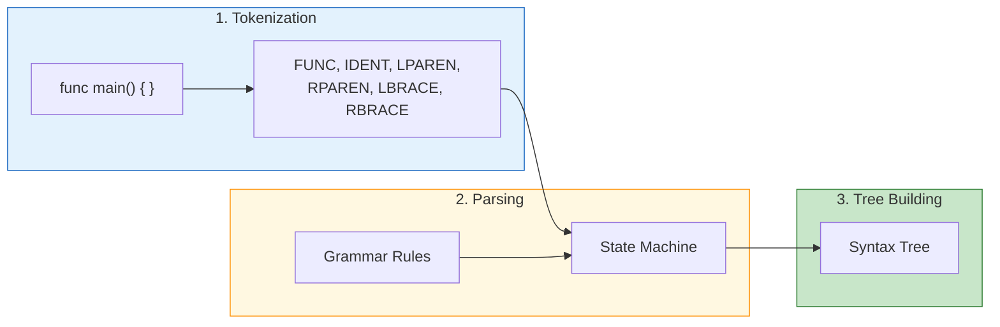

### Stage 1: Tokenization

First, the raw text is split into **tokens** (meaningful pieces):

```
Source: func main() { return 0 }

Tokens:
┌──────┬─────────────┬──────────────────┐
│ Text │ Token Type  │ Position         │
├──────┼─────────────┼──────────────────┤
│ func │ KEYWORD     │ bytes 0-4        │
│ main │ IDENTIFIER  │ bytes 5-9        │
│ (    │ LPAREN      │ byte 9           │
│ )    │ RPAREN      │ byte 10          │
│ {    │ LBRACE      │ byte 12          │
│return│ KEYWORD     │ bytes 14-20      │
│ 0    │ NUMBER      │ byte 21          │
│ }    │ RBRACE      │ byte 23          │
└──────┴─────────────┴──────────────────┘
```

### Stage 2: Parsing (State Machine)

The parser reads tokens and navigates through states based on grammar rules:

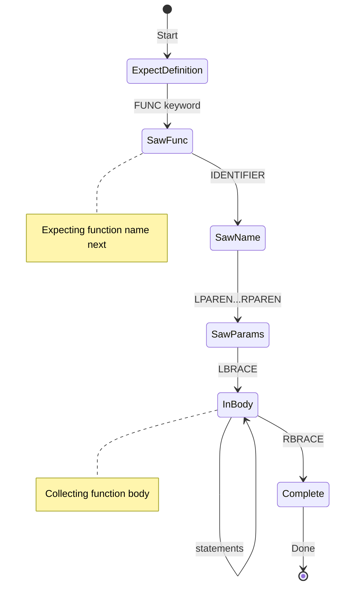

Each state knows what tokens are valid next. Invalid tokens trigger error recovery.

### Stage 3: Tree Building

As the parser matches grammar rules, it builds tree nodes:

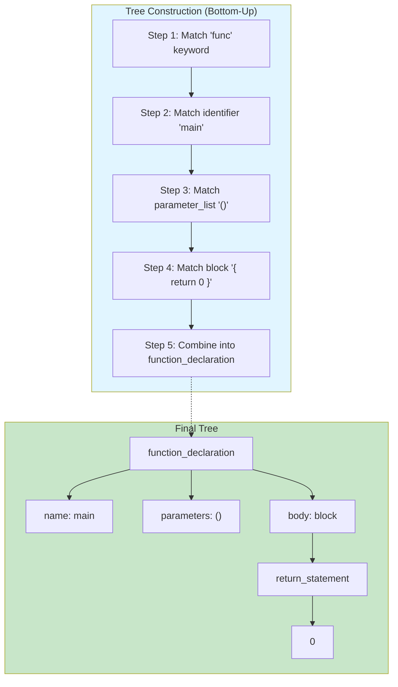

---

## Understanding the Syntax Tree

### Node Anatomy

Every node in the tree has:

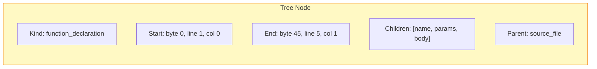

| Property | What It Tells You |
|----------|-------------------|
| **Kind** | What type of code element (function, if, variable) |
| **Start/End** | Exact byte positions in source file |
| **Children** | Sub-elements contained within |
| **Parent** | What contains this element |

### Named vs Anonymous Children

Nodes can have **named** children (important) and **anonymous** children (syntax):

```go
func greet(name string) string {
    return "Hello, " + name
}
```

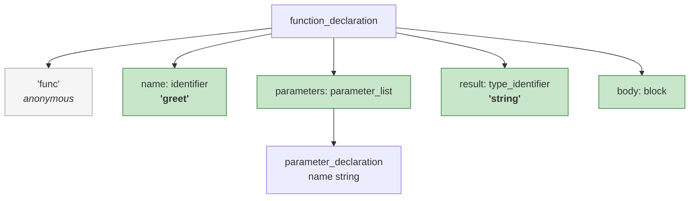

**Named children** (green) carry semantic meaning.
**Anonymous children** (gray) are just syntax tokens like `func`, `{`, `}`.

---

## Tree Traversal

### Depth-First Walk

To extract chunks, AmanMCP walks the tree depth-first:

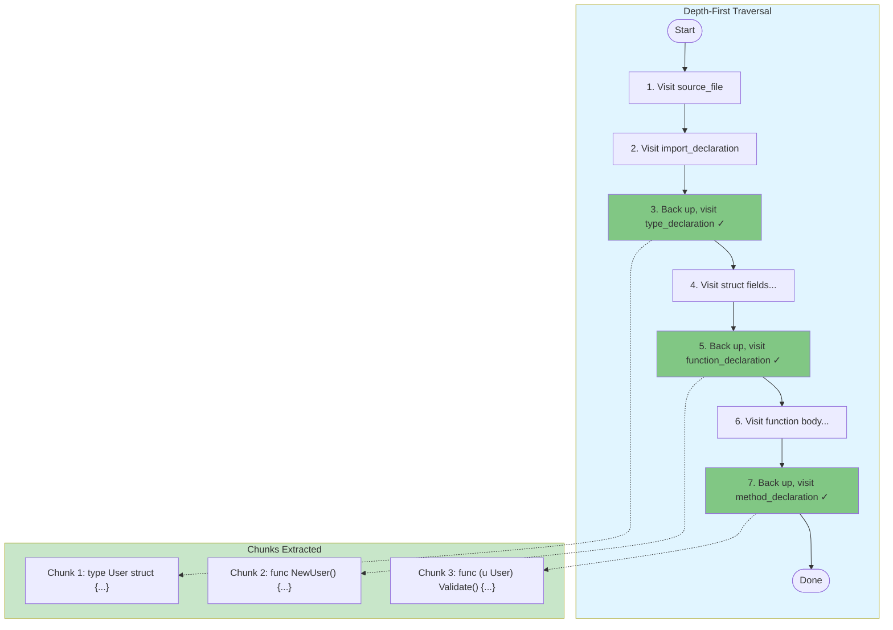

The algorithm:
1. Visit current node
2. If it's a chunk type (function, type, etc.), extract it
3. Recurse into children
4. Move to next sibling
5. When no siblings, go back to parent

### What Gets Extracted

AmanMCP extracts these node types:

| Language | Node Types |
|----------|------------|
| **Go** | `function_declaration`, `method_declaration`, `type_declaration` |
| **Python** | `function_definition`, `class_definition` |
| **TypeScript** | `function_declaration`, `class_declaration`, `interface_declaration` |
| **Rust** | `function_item`, `impl_item`, `struct_item`, `enum_item` |

---

## Language Detection

Before parsing, AmanMCP must choose the right grammar:

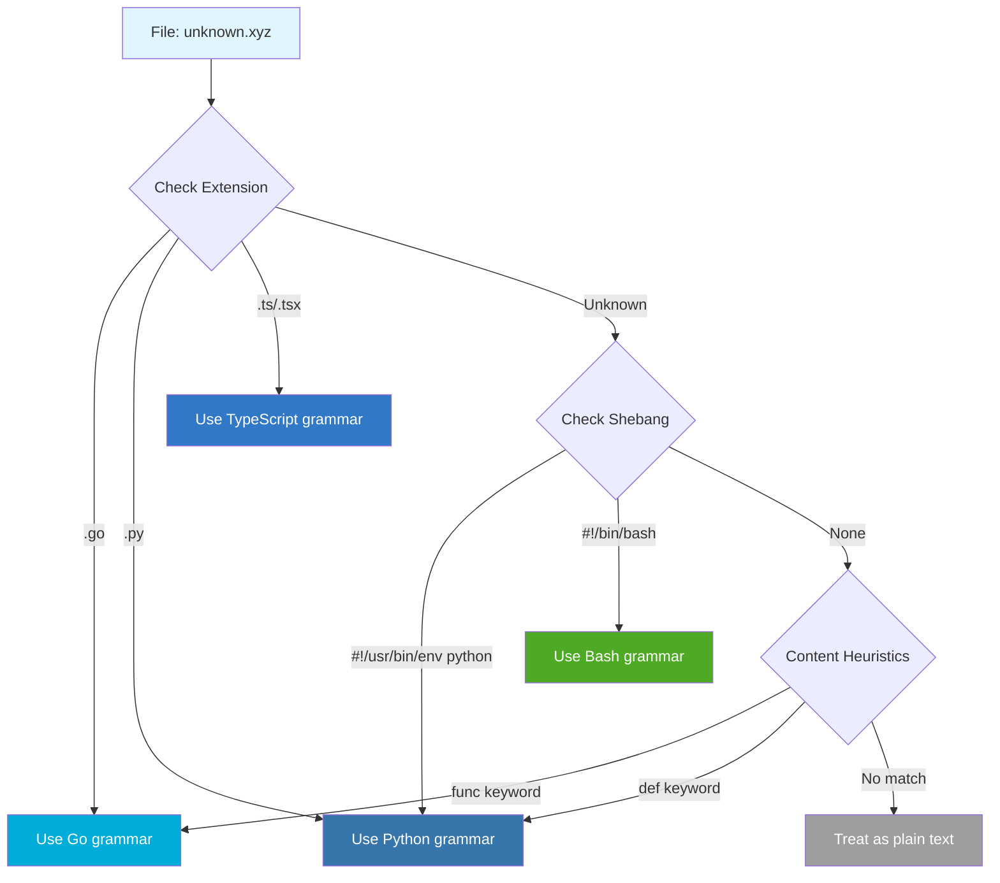

### Detection Priority

1. **File extension** (fastest, most reliable)
2. **Shebang line** (`#!/usr/bin/env python`)
3. **Content analysis** (keyword detection)
4. **Fallback** to plain text

---

## Incremental Parsing

When a file changes, tree-sitter doesn't re-parse everything:

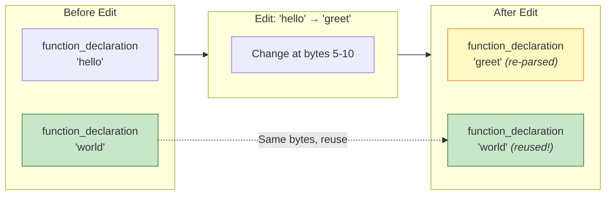

**How it works:**
1. Tell parser what bytes changed
2. Parser reuses unchanged subtrees
3. Only re-parses affected regions

**Impact for AmanMCP:**
- File edit → only changed functions re-indexed
- Milliseconds instead of seconds for large files

---

## Error Recovery

Tree-sitter is **error-tolerant**. Syntax errors don't crash parsing:

```go
// Broken code
func incomplete(
    // missing closing paren and body
```

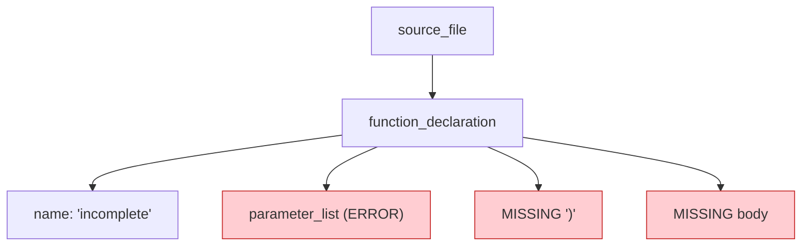

The tree still exists with `ERROR` and `MISSING` nodes. AmanMCP can:
- Detect the error with `node.HasError()`
- Still extract partial information
- Skip malformed chunks gracefully

---

## Extracting Context

For each chunk, AmanMCP extracts rich context:

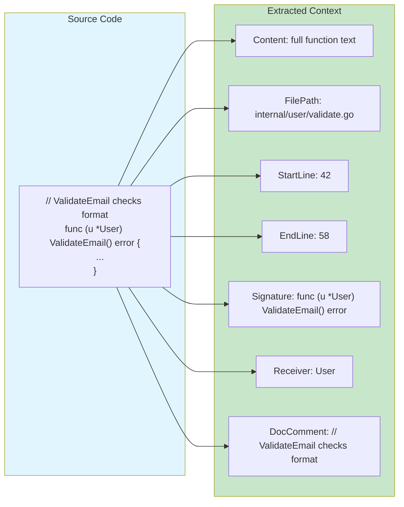

This context helps with:
- **Search ranking** - function names are weighted higher
- **Result display** - show file path and line numbers
- **Navigation** - jump directly to the code

---

## Supported Languages

### Tier 1: Excellent Support

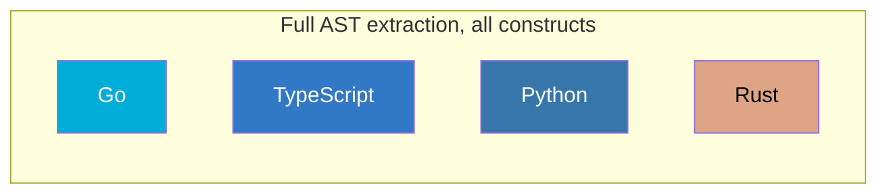

### Tier 2: Good Support

| Language | Notes |
|----------|-------|
| Java | Classes, methods, interfaces |
| C/C++ | Functions, structs, templates |
| Ruby | Classes, methods, modules |
| JavaScript | Functions, classes, arrow functions |

### Tier 3: Basic Support

| Language | Notes |
|----------|-------|
| Markdown | Headers, code blocks |
| JSON/YAML | Structure extraction |
| HTML | Tags and attributes |

---

## The Chunk Lifecycle

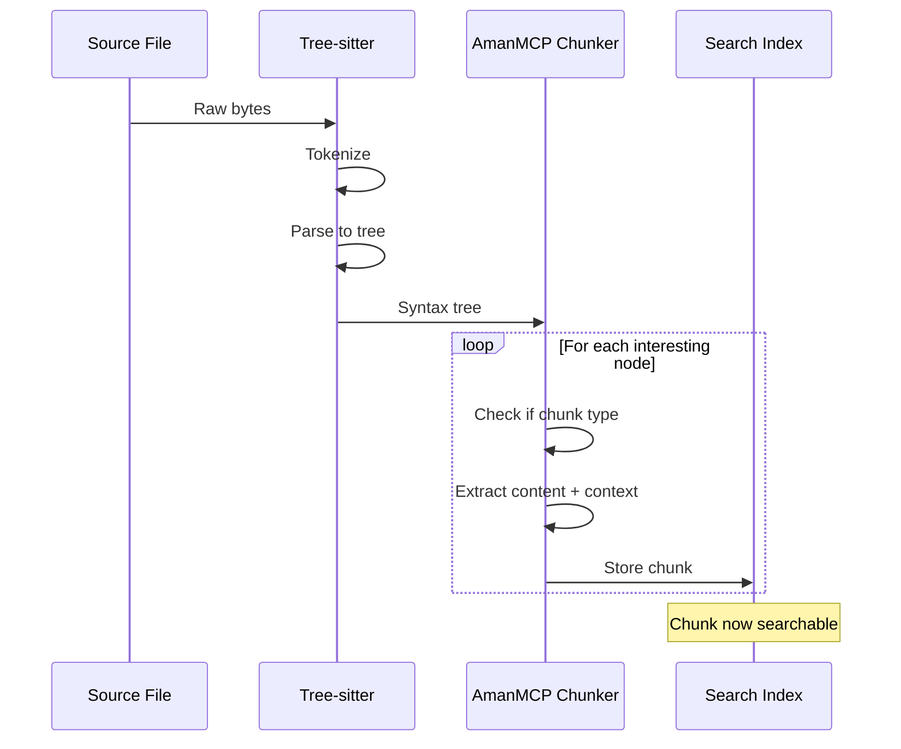

---

## Key Takeaways

| Concept | What It Means |
|---------|---------------|
| **Tokenization** | Split text into meaningful pieces |
| **Grammar** | Rules defining language syntax |
| **Syntax Tree** | Hierarchical code representation |
| **Depth-First Walk** | Visit all nodes systematically |
| **Incremental Parse** | Only re-parse what changed |
| **Error Recovery** | Handle broken code gracefully |

---

## Next Steps

| Want to... | Read |
|------------|------|
| See Go implementation details | [Advanced](advanced.md) |
| Understand the full indexing flow | [Indexing Pipeline](../indexing-pipeline.md) |
| Learn about code search | [Hybrid Search](../hybrid-search/) |

---

*Tree-sitter transforms code from text into data structures you can navigate, query, and extract.*
