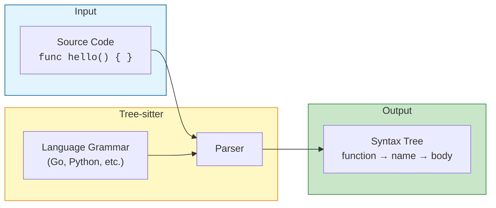
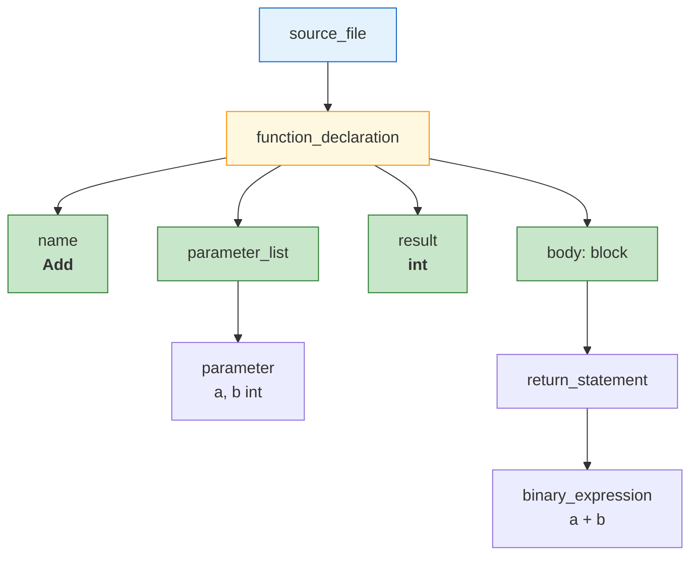
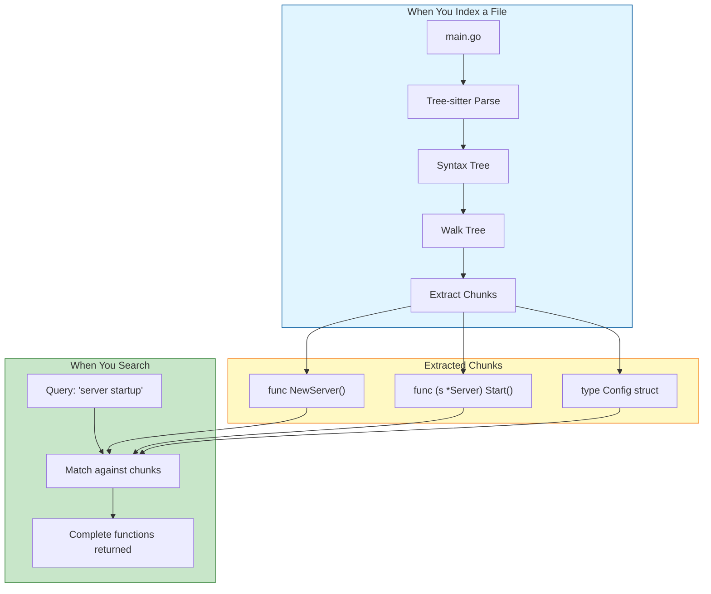

# Tree-sitter Overview

What tree-sitter is, why it matters, and why regex fails for code parsing.

**Reading time:** 4 minutes
**Audience:** Everyone
**Prerequisites:** None

---

## Quick Summary

- Tree-sitter **understands code structure**, not just text patterns
- It builds a **syntax tree** (like a map of your code)
- Regex can't handle **nested structures** (braces inside braces)
- AmanMCP uses tree-sitter to extract **meaningful chunks** (functions, types)

---

## The Problem: Code Is Structured

Code isn't just text - it has structure. Consider this Go function:

```go
func ProcessOrder(order Order) error {
    if order.Items == nil {
        return errors.New("no items")
    }
    for _, item := range order.Items {
        if item.Price < 0 {
            return errors.New("invalid price")
        }
    }
    return nil
}
```

A human sees:
- One function called `ProcessOrder`
- Takes an `Order` parameter, returns `error`
- Contains an `if` statement and a `for` loop
- The `for` loop contains another `if`

**How do we teach a computer to see the same thing?**

---

## Why Regex Fails

### The Nested Brace Problem

Try to write a regex that finds where `ProcessOrder` ends:

```go
func outer() {
    if true {
        go func() {
            // nested anonymous function
        }()
    }
}  // ← Which closing brace ends outer()?
```

**Regex sees:** `{`, `{`, `{`, `}`, `}`, `}`

**Regex thinks:** "I found 3 opening braces and 3 closing braces... but which ones match?"

**The answer:** Regex literally cannot solve this. It's mathematically proven that regular expressions cannot match nested structures.

### Visual: Regex vs Tree-sitter

```
┌─────────────────────────────────────────────────────────────┐
│                     REGEX APPROACH                          │
├─────────────────────────────────────────────────────────────┤
│                                                             │
│  Pattern: func\s+(\w+)\s*\([^)]*\)\s*{                      │
│                                                             │
│  Input:   func outer() { if { } func inner() { } }         │
│                    ↑                      ↑                 │
│           Matches here          Also matches here!          │
│                                                             │
│  Problem: Can't find where outer() actually ends            │
│           Can't distinguish function from if-block          │
│                                                             │
└─────────────────────────────────────────────────────────────┘

┌─────────────────────────────────────────────────────────────┐
│                   TREE-SITTER APPROACH                      │
├─────────────────────────────────────────────────────────────┤
│                                                             │
│  Builds a tree:                                             │
│                                                             │
│  source_file                                                │
│  └── function_declaration (outer)                           │
│      ├── name: "outer"                                      │
│      ├── parameters: ()                                     │
│      └── body: block                                        │
│          ├── if_statement                                   │
│          │   └── block { }                                  │
│          └── function_declaration (inner)                   │
│              ├── name: "inner"                              │
│              └── body: block { }                            │
│                                                             │
│  Result: Knows exactly where each function starts/ends      │
│                                                             │
└─────────────────────────────────────────────────────────────┘
```

---

## What Tree-sitter Does

Tree-sitter is a **parser generator** - it reads grammar rules for a language and creates a parser that understands that language's structure.



### The Result: A Syntax Tree

For this code:

```go
func Add(a, b int) int {
    return a + b
}
```

Tree-sitter produces:



Now we can ask questions like:
- "Give me all function declarations" → Walk tree, find `function_declaration` nodes
- "What's the function name?" → Look at the `name` child
- "Where does the function end?" → Check `EndByte()` of the node

---

## Why This Matters for Code Search

### Without Tree-sitter (Line-based Chunking)

```
Chunk 1: "func ProcessOrder(order Order) error {"
Chunk 2: "    if order.Items == nil {"
Chunk 3: "        return errors.New(\"no items\")"
Chunk 4: "    }"
...
```

**Problems:**
- Chunks are fragments, not complete thoughts
- Search for "ProcessOrder" might return just the signature
- No understanding of what belongs together

### With Tree-sitter (AST-aware Chunking)

```
Chunk 1: Complete ProcessOrder function (all 12 lines)
Chunk 2: Complete NextFunction (all 8 lines)
...
```

**Benefits:**
- Each chunk is a **complete, meaningful unit**
- Search returns **whole functions**, not fragments
- Context is preserved

---

## The Key Insight

| Approach | Sees Code As | Result |
|----------|--------------|--------|
| **Regex** | Flat text with patterns | Fragile, incomplete extraction |
| **Line splitting** | Lines of text | Arbitrary boundaries |
| **Tree-sitter** | Structured tree | Precise, complete extraction |

Tree-sitter doesn't just find text - it **understands structure**.

---

## AmanMCP's Use of Tree-sitter



AmanMCP extracts these node types as chunks:
- **Functions** - `function_declaration`
- **Methods** - `method_declaration`
- **Types** - `type_declaration`
- **Constants** - `const_declaration`

Each chunk is a complete, self-contained piece of code.

---

## Summary

| Concept | What It Means |
|---------|---------------|
| **Parser** | Reads code, builds tree |
| **Syntax Tree** | Structured representation of code |
| **Node** | One element in the tree (function, if-statement, etc.) |
| **Grammar** | Rules that define a language's syntax |

---

## Next Steps

| Want to... | Read |
|------------|------|
| See how parsing works step-by-step | [How It Works](how-it-works.md) |
| Learn the Go implementation | [Advanced](advanced.md) |
| Understand the full indexing flow | [Indexing Pipeline](../indexing-pipeline.md) |

---

*Tree-sitter sees code the way programmers do - as structured, meaningful units.*
