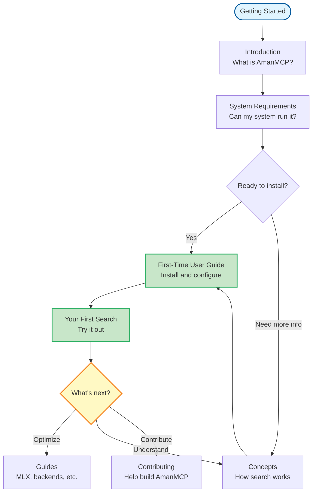

# Getting Started with AmanMCP

Your path from zero to productive with AmanMCP. This section contains everything you need to get started.

---

## Start Here

| Step | Document | What You'll Learn |
|------|----------|-------------------|
| 1 | [Introduction](introduction.md) | What AmanMCP is, why it exists, how it solves the RAG problem |
| 2 | [System Requirements](SYSTEM_REQUIREMENTS.md) | Hardware, software, and platform requirements |
| 3 | [First-Time User Guide](../guides/first-time-user-guide.md) | Step-by-step installation and first search |

---

## Reading Flow



---

## Quick Install (TL;DR)

If you want to get started immediately:

```bash
# Install via Homebrew (macOS)
brew install amanmcp

# Or build from source
git clone https://github.com/Aman-CERP/amanmcp
cd amanmcp
make build && make install-local

# Initialize your project
cd your-project
amanmcp init

# Start searching
amanmcp search "authentication"
```

**Need more details?** Follow the [First-Time User Guide](../guides/first-time-user-guide.md).

---

## Prerequisites Checklist

Before installing, ensure you have:

| Requirement | Check Command | Expected |
|-------------|---------------|----------|
| macOS 12+ / Linux / Windows 10+ | `uname -a` | Your OS version |
| 16GB+ RAM recommended | `free -h` (Linux) or Activity Monitor | Available memory |
| 100MB+ free disk space | `df -h .` | Free space in project directory |

**Verify everything:** After install, run `amanmcp doctor` to check your system.

---

## What's in This Section

### [Introduction](introduction.md)
The "why" behind AmanMCP. Understand the problem it solves: friction-free code search for AI assistants. Read this if you want to understand what makes AmanMCP different from grep or cloud-based RAG tools.

### [System Requirements](SYSTEM_REQUIREMENTS.md)
Detailed hardware and software requirements. Memory sizing guide, platform compatibility, and troubleshooting. Check this if you're unsure whether your system can run AmanMCP.

---

## After Getting Started

Once you're up and running:

| Goal | Go To |
|------|-------|
| Learn how search works | [Concepts](../concepts/) |
| Optimize for Apple Silicon | [MLX Setup Guide](../guides/mlx-setup.md) |
| Enable auto-reindexing | [Auto-Reindexing Guide](../guides/auto-reindexing.md) |
| Contribute code | [Contributing](../contributing/) |

---

## Need Help?

- **Something not working?** Run `amanmcp doctor`
- **Configuration issues?** See [Reference](../reference/)
- **Have a question?** [GitHub Discussions](https://github.com/Aman-CERP/amanmcp/discussions)

---

*Next: [Introduction](introduction.md) - Understand what AmanMCP is and why it exists*
