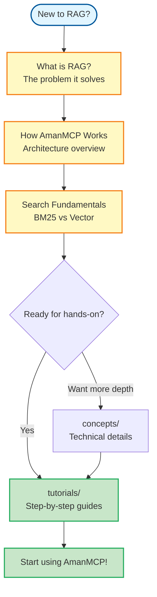

# Learning: Foundational Concepts

New to RAG, embeddings, or hybrid search? Start here. This section explains the "why" and "how" behind AmanMCP's core concepts in plain language.

---

## Who This Is For

This section is written for developers who:
- Are new to RAG (Retrieval-Augmented Generation)
- Haven't worked with embeddings or vector search before
- Want to understand *why* AmanMCP works, not just *how* to use it
- Learn best through explanations before diving into code

**Already familiar with RAG?** Skip to [Getting Started](../getting-started/) or [Tutorials](../tutorials/).

---

## Learning Path

Read these in order for the best learning experience:

| Step | Document | What You'll Learn | Time |
|------|----------|-------------------|------|
| 1 | [What is RAG?](what-is-rag.md) | The problem RAG solves, why AI needs external memory | 5 min |
| 2 | [How AmanMCP Works](how-amanmcp-works.md) | AmanMCP's architecture in plain language | 5 min |
| 3 | [Search Fundamentals](search-fundamentals.md) | BM25 vs Vector search, why hybrid is better | 8 min |

---

## Learning Flow

---

## Key Concepts Summary

Before you start, here's a quick glossary:

| Term | One-Line Definition |
|------|---------------------|
| **RAG** | Giving AI access to external information so it can answer questions about your data |
| **Embedding** | A list of numbers that represents the "meaning" of text |
| **Vector Search** | Finding similar text by comparing embeddings |
| **BM25** | Keyword search that matches exact words (like a smarter grep) |
| **Hybrid Search** | Combining keyword + vector search for the best of both |

These are explained in depth in the documents below.

---

## Documents

### [What is RAG?](what-is-rag.md)

**The problem:** AI assistants have a knowledge cutoff. They can't see your code, your docs, or recent changes.

**The solution:** RAG (Retrieval-Augmented Generation) gives AI the ability to "look things up" in your data before responding.

This document explains RAG without jargon, using concrete examples from code search.

---

### [How AmanMCP Works](how-amanmcp-works.md)

A 3-minute overview of AmanMCP's architecture. You'll learn:
- How your code gets indexed
- What happens when you search
- Why it runs 100% locally (privacy)

Visual diagrams included.

---

### [Search Fundamentals](search-fundamentals.md)

The core insight behind AmanMCP: neither keyword search nor semantic search is perfect alone. This document explains:
- What BM25 is and why it matters
- What vector/semantic search is
- Why combining them (hybrid) gives better results
- How AmanMCP balances both

No math required - intuition-first explanations.

---

## After Learning

| When You're Ready For... | Go To |
|--------------------------|-------|
| Hands-on practice | [Tutorials](../tutorials/) |
| Technical deep dives | [Concepts](../concepts/) |
| CLI commands | [Reference](../reference/) |
| Configuration options | [Configuration](../reference/configuration.md) |

---

## Further Reading

Want to learn more about these topics?

| Topic | External Resource |
|-------|-------------------|
| RAG in depth | [LangChain RAG Tutorial](https://python.langchain.com/docs/tutorials/rag/) |
| Embeddings intuition | [Jay Alammar's Illustrated Word2Vec](https://jalammar.github.io/illustrated-word2vec/) |
| BM25 explained | [Elasticsearch BM25 Guide](https://www.elastic.co/blog/practical-bm25-part-2-the-bm25-algorithm-and-its-variables) |
| Vector databases | [Weaviate Vector DB Concepts](https://weaviate.io/developers/weaviate/concepts) |

---

*This section is designed for learning. For doing, see [Tutorials](../tutorials/). For looking things up, see [Reference](../reference/).*
