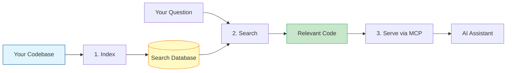
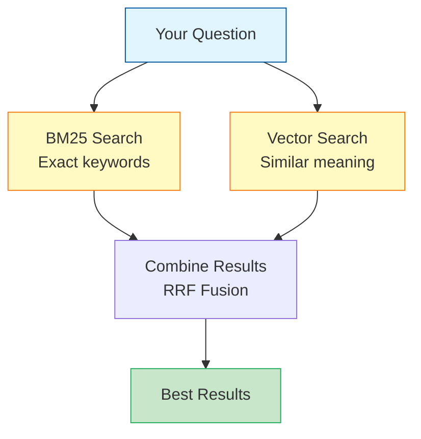
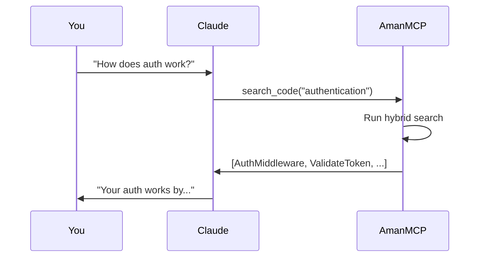
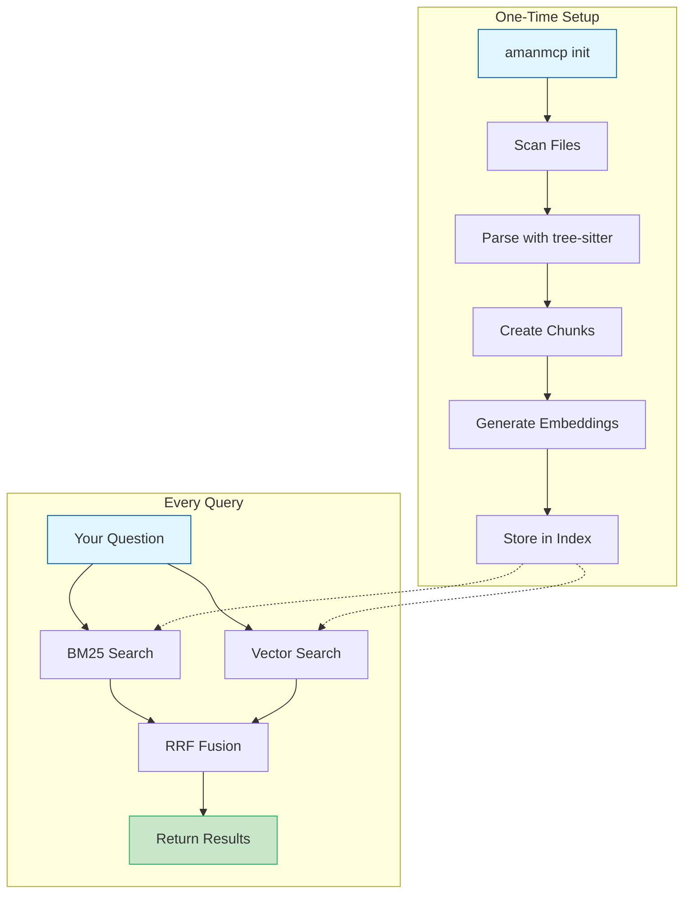

# How AmanMCP Works

A 3-minute overview of AmanMCP's architecture. No prior knowledge required.

**Reading time:** 5 minutes

---

## The Big Picture

AmanMCP does three things:

1. **Index** - Scan your code and create a searchable database
2. **Search** - Find relevant code when you ask questions
3. **Serve** - Provide results to your AI assistant

Everything runs locally. Your code never leaves your machine.



---

## Step 1: Indexing

When you run `amanmcp init`, AmanMCP scans your codebase:

### What gets indexed?

```
Your Project/
├── src/              ← Source code (indexed)
├── internal/         ← Internal packages (indexed)
├── docs/             ← Documentation (indexed)
├── node_modules/     ← Dependencies (skipped)
├── .git/             ← Git internals (skipped)
└── vendor/           ← Vendor deps (skipped)
```

AmanMCP automatically respects your `.gitignore` patterns.

### How code gets chunked

Unlike naive text search, AmanMCP understands code structure. It uses [tree-sitter](https://tree-sitter.github.io/) to parse your code into meaningful chunks:

```
┌─────────────────────────────────────────────────────────────┐
│  Naive Chunking (BAD)              AST-Aware Chunking (GOOD)│
│                                                             │
│  Split at 500 chars:               Split at boundaries:     │
│                                                             │
│  "func ProcessPay"                 "func ProcessPayment(...)"│
│  "ment(order Order)"               "  (complete function)"  │
│  "  return stripe..."                                       │
│                                                             │
│  ✗ Broken functions                ✓ Complete functions     │
│  ✗ Meaningless fragments           ✓ Semantic units         │
└─────────────────────────────────────────────────────────────┘
```

### What gets stored

For each chunk of code, AmanMCP stores:

| What | Why |
|------|-----|
| The code itself | For keyword search (BM25) |
| An embedding | For semantic search (vectors) |
| Metadata | File path, line numbers, language |

---

## Step 2: Searching

When you ask a question, AmanMCP runs two searches in parallel:

### Hybrid Search



**Why two searches?**

| Search Type | Finds | Example |
|-------------|-------|---------|
| BM25 (Keyword) | Exact matches | "func ValidateToken" finds functions with that exact name |
| Vector (Semantic) | Conceptually similar | "authentication" finds `CheckCredentials`, `VerifyUser` |

**The combination is more powerful than either alone.** BM25 catches exact terms you know. Vector search catches related concepts you might not have thought of.

---

## Step 3: Serving via MCP

MCP (Model Context Protocol) is how AI assistants like Claude communicate with external tools.



When you ask Claude about your code:
1. Claude calls AmanMCP via MCP protocol
2. AmanMCP searches and returns relevant code
3. Claude reads the code and responds

You see the final answer. The search happens invisibly.

---

## The Data Flow

Here's everything together:



---

## Why Local?

AmanMCP runs 100% on your machine:

| Concern | AmanMCP's Answer |
|---------|------------------|
| **Privacy** | Code never leaves your machine |
| **Speed** | No network latency |
| **Cost** | No API calls, no tokens |
| **Offline** | Works without internet |

The only network calls are to a local embedding service (Ollama or MLX), both running on your machine.

---

## Key Technologies

| Component | Technology | Why |
|-----------|------------|-----|
| Parsing | tree-sitter | Same parser as Neovim, Zed - proven reliable |
| Keyword Search | SQLite FTS5 (BM25) | Fast, concurrent, battle-tested |
| Vector Search | HNSW | Efficient nearest-neighbor search |
| Embeddings | Ollama/MLX | Local inference, no cloud |
| Protocol | MCP | Standard for AI tool integration |

---

## Summary

| Phase | What Happens |
|-------|--------------|
| **Index** | Scan code, parse structure, create embeddings, store in database |
| **Search** | Run keyword + semantic search, combine results |
| **Serve** | Return relevant code to AI assistant via MCP |

All local. All private. All fast.

---

## Next Steps

Now that you understand the architecture, learn about the search itself:

**Next:** [Search Fundamentals](search-fundamentals.md) - BM25 vs Vector search explained

---

## Want More Detail?

- [Architecture Documentation](../reference/architecture/) - Full technical deep dive
- [Concepts](../concepts/) - Detailed explanations of each component
- [Technology Validation](../reference/architecture/technology-validation-2026.md) - Why we chose these technologies
