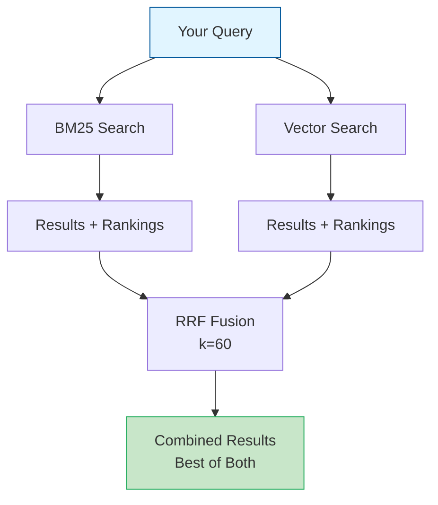
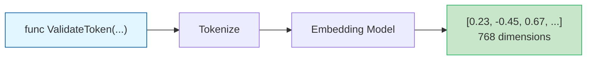

# Search Fundamentals

Why AmanMCP uses hybrid search, and what that means for your code search results.

**Reading time:** 8 minutes

---

## The Two Ways to Search

There are fundamentally two ways to search text:

| Approach | Question It Answers | Example |
|----------|---------------------|---------|
| **Keyword** | "Does this text contain these words?" | Find files containing "authenticate" |
| **Semantic** | "Is this text about the same concept?" | Find code related to authentication |

Neither is perfect. AmanMCP uses **both**.

---

## Keyword Search (BM25)

### How It Works

BM25 is like a smarter `grep`. It finds documents containing your search terms and ranks them by relevance.

```
Query: "validate user token"

BM25 looks for documents containing:
- "validate"
- "user"
- "token"

Ranks higher if:
- Terms appear more often
- Document is shorter (more focused)
- Terms are rare across all documents
```

### What BM25 Does Well

| Strength | Example |
|----------|---------|
| Exact matches | Search "ProcessPayment" → finds `func ProcessPayment()` |
| Specific identifiers | Search "E1001" → finds error code definitions |
| Known function names | Search "ValidateToken" → finds that exact function |

### What BM25 Misses

| Weakness | Example |
|----------|---------|
| Synonyms | Search "authenticate" → misses "verify credentials" |
| Related concepts | Search "error handling" → misses "panic recovery" |
| Different naming | Search "user" → misses code that says "customer" |

**BM25 is literal.** It finds what you type, not what you mean.

---

## Semantic Search (Vectors)

### The Key Idea: Embeddings

Semantic search works by converting text into numbers (embeddings) that capture **meaning**.

```
┌─────────────────────────────────────────────────────────────┐
│  Text                        →  Embedding (simplified)      │
│                                                             │
│  "authenticate user"         →  [0.8, 0.3, 0.9, ...]       │
│  "verify credentials"        →  [0.8, 0.3, 0.8, ...]       │
│  "process payment"           →  [0.1, 0.9, 0.2, ...]       │
│                                                             │
│  Notice: "authenticate" and "verify credentials" have       │
│  similar numbers - they're semantically close!              │
└─────────────────────────────────────────────────────────────┘
```

When you search, your query gets embedded too. Then we find code whose embedding is *similar* to yours.

### What Semantic Search Does Well

| Strength | Example |
|----------|---------|
| Conceptual matches | "authentication" finds `VerifyCredentials()` |
| Synonyms | "cancel" finds "abort", "terminate" |
| Intent | "handle errors" finds `RecoverPanic()` |

### What Semantic Search Misses

| Weakness | Example |
|----------|---------|
| Exact identifiers | "E1001" might miss exact error code |
| Typos in code | "validateUser" vs "valdateUser" |
| Very specific names | "processPaymentWithStripe" might match other payment code |

**Semantic search understands meaning but loses precision.**

---

## Why Hybrid? A Concrete Example

Let's search for authentication code:

```
Query: "validate user authentication token"

┌─────────────────────────────────────────────────────────────┐
│  BM25 Results                 │  Vector Results             │
│  (Keyword Match)              │  (Semantic Match)           │
├───────────────────────────────┼─────────────────────────────┤
│  1. func ValidateToken()      │  1. func CheckCredentials() │
│  2. type UserAuth struct      │  2. func VerifySession()    │
│  3. var authToken string      │  3. func ValidateToken()    │
│  4. "user authentication"     │  4. middleware/auth.go      │
│     (in comments)             │                             │
└───────────────────────────────┴─────────────────────────────┘
```

**BM25 finds:** Code with exact words like "validate", "token", "user"
**Vector finds:** Code *about* authentication, even with different words

**Combined:** You get both the exact matches AND the conceptually related code.

---

## How AmanMCP Combines Them

AmanMCP uses **Reciprocal Rank Fusion (RRF)** to combine results:



### The Math (Simplified)

Don't worry about formulas. The intuition is:

1. Each search produces a ranked list
2. Items ranked highly by **both** searches score highest
3. Items ranked highly by **one** search still appear (but lower)

### The Weights

AmanMCP uses:
- **BM25:** 35% weight (keyword precision)
- **Semantic:** 65% weight (conceptual understanding)

These defaults work well for code search. You can tune them if needed.

---

## Real-World Comparison

### Query: "error handling"

| Rank | BM25 Only | Vector Only | Hybrid |
|------|-----------|-------------|--------|
| 1 | `handleError()` | `RecoverPanic()` | `handleError()` |
| 2 | `ErrorHandler{}` | `handleError()` | `RecoverPanic()` |
| 3 | `// error handling` | `RetryWithBackoff()` | `ErrorHandler{}` |
| 4 | `err != nil` | `GracefulShutdown()` | `RetryWithBackoff()` |

**Analysis:**
- BM25 finds exact "error" matches (including comments)
- Vector finds conceptually related code (retry, recovery)
- Hybrid gives you the best of both

---

## When Each Search Shines

| Scenario | Best Approach | Why |
|----------|---------------|-----|
| "Find the exact function name" | BM25 | Exact match needed |
| "How does auth work?" | Vector | Conceptual understanding |
| "Error E1001" | BM25 | Specific identifier |
| "Similar to this code pattern" | Vector | Pattern matching |
| Most real queries | Hybrid | You want both |

---

## The Embedding Process

Here's how text becomes searchable vectors:



AmanMCP uses:
- **Ollama** with `nomic-embed-text` (default)
- **MLX** for faster embeddings on Apple Silicon
- **Static** embeddings for offline use

All run locally. Your code never leaves your machine.

---

## Summary

| Concept | What It Means |
|---------|---------------|
| **BM25** | Keyword search - finds exact words |
| **Vector** | Semantic search - finds similar meaning |
| **Hybrid** | Best of both - precision + understanding |
| **RRF** | Algorithm to combine rankings fairly |
| **Embeddings** | Numbers that represent text meaning |

---

## Practical Takeaways

1. **Don't overthink your queries.** Hybrid search handles both exact terms and vague concepts.

2. **Exact identifiers work great.** BM25 ensures `ProcessPayment` finds exactly that.

3. **Conceptual queries work too.** "authentication flow" will find related code even with different names.

4. **The defaults are good.** 35/65 BM25/Vector weighting works well for most codebases.

---

## Next Steps

Ready to try it yourself?

**Next:** [Your First Search](../tutorials/your-first-search.md) - Hands-on tutorial

---

## Want More Detail?

- [Hybrid Search Concepts](../concepts/hybrid-search/) - Technical deep dive
- [Vector Search](../concepts/vector-search/) - How embeddings work
- [Configuration](../reference/configuration.md) - Tuning search weights
