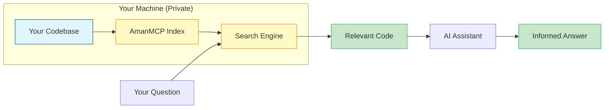

# What is RAG?

RAG stands for **Retrieval-Augmented Generation**. It's how we give AI assistants access to information they weren't trained on - like your codebase.

**Reading time:** 5 minutes

---

## The Problem: AI Has a Memory Gap

Imagine you're working with an AI assistant like Claude. You ask:

> "How does the authentication middleware work in our project?"

The AI doesn't know. It can't know. It was trained on public data, not your private codebase. Without access to your code, it can only give generic answers about authentication middleware *in general*.

This is the **knowledge gap problem**:

```
┌─────────────────────────────────────────────────────────────┐
│                     AI's Knowledge                          │
│                                                             │
│  ✓ General programming concepts                             │
│  ✓ Public documentation                                     │
│  ✓ Common patterns and best practices                       │
│                                                             │
│  ✗ YOUR codebase                                            │
│  ✗ YOUR documentation                                       │
│  ✗ Recent changes you made yesterday                        │
└─────────────────────────────────────────────────────────────┘
```

---

## The Solution: Let AI Look Things Up

RAG solves this by giving AI the ability to **retrieve relevant information** before generating a response.

Think of it like this:

| Without RAG | With RAG |
|-------------|----------|
| Student taking a closed-book exam | Student who can use reference books |
| Guessing based on general knowledge | Looking up the specific answer |
| "I don't have access to your code" | "Based on your `auth.go` file..." |

Here's what happens with RAG:

```
┌─────────────────────────────────────────────────────────────┐
│  1. You ask: "How does auth work?"                          │
│                    ↓                                        │
│  2. RAG searches your codebase for relevant code            │
│                    ↓                                        │
│  3. RAG finds: auth.go, middleware.go, config.go            │
│                    ↓                                        │
│  4. AI reads the relevant code                              │
│                    ↓                                        │
│  5. AI answers based on YOUR actual implementation          │
└─────────────────────────────────────────────────────────────┘
```

---

## RAG in Plain English

**Retrieval** = Find relevant information from your data
**Augmented** = Give that information to the AI
**Generation** = AI creates a response using that context

It's like giving the AI a library card to your codebase.

---

## Why Does This Matter for Code?

Code has unique challenges:

### Challenge 1: Code is private
Your codebase isn't on the public internet. AI models can't see it during training.

### Challenge 2: Code changes constantly
Even if AI knew your code, it would be outdated within hours of your next commit.

### Challenge 3: Code is interconnected
Understanding one function often requires understanding its dependencies, callers, and related code.

RAG addresses all three:
- **Private:** RAG runs locally - your code never leaves your machine
- **Fresh:** RAG indexes your current code, including recent changes
- **Context:** RAG retrieves related code, not just exact matches

---

## How AmanMCP Implements RAG

AmanMCP is a RAG system specifically designed for code:



1. **Index:** AmanMCP scans your codebase and creates a searchable index
2. **Search:** When you ask a question, AmanMCP finds relevant code
3. **Retrieve:** The relevant code is sent to the AI as context
4. **Generate:** The AI answers based on your actual code

---

## The Key Insight

RAG separates **knowledge** from **reasoning**:

| Component | Responsibility |
|-----------|----------------|
| RAG (AmanMCP) | Finds the right information |
| AI (Claude) | Reasons about that information |

The AI brings intelligence. RAG brings your data. Together, they can answer questions about *your* code.

---

## Example: Before and After RAG

**Without RAG:**

> **You:** "How does our payment processing work?"
>
> **AI:** "Payment processing typically involves validating payment details, connecting to a payment gateway like Stripe or PayPal, handling the transaction, and storing the result. Here's a generic example..."

**With RAG (AmanMCP):**

> **You:** "How does our payment processing work?"
>
> **AI:** "Based on your `PaymentService` in `internal/billing/payment.go`, your payment flow:
> 1. Validates the cart via `ValidateCart()` (line 45)
> 2. Creates a Stripe PaymentIntent via `createIntent()` (line 78)
> 3. Handles webhooks in `HandleWebhook()` (line 112)
> 4. Updates order status in `markPaid()` (line 156)
>
> The retry logic uses exponential backoff configured in `config.yaml`..."

The difference: specific, accurate answers based on *your* code.

---

## Summary

| Concept | What It Means |
|---------|---------------|
| **RAG** | Giving AI the ability to look things up in your data |
| **The Problem** | AI doesn't know your private, changing codebase |
| **The Solution** | Search your code, give results to AI as context |
| **AmanMCP** | A RAG system built specifically for code search |

---

## Next Steps

Now that you understand RAG, learn how AmanMCP implements it:

**Next:** [How AmanMCP Works](how-amanmcp-works.md) - Architecture overview in plain language

---

## Further Reading

- [RAG explained by Pinecone](https://www.pinecone.io/learn/retrieval-augmented-generation/) - General RAG concepts
- [LangChain RAG Tutorial](https://python.langchain.com/docs/tutorials/rag/) - Building RAG systems
- [How AmanMCP Works](how-amanmcp-works.md) - AmanMCP-specific implementation
