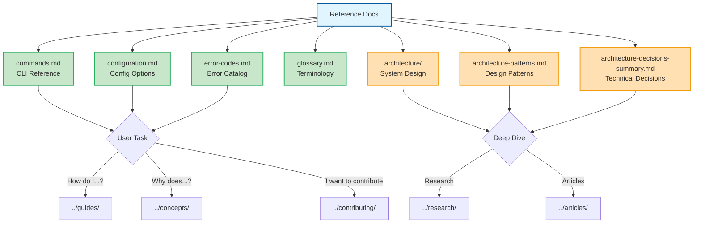

# Reference Documentation

Complete technical reference for AmanMCP. This section contains authoritative, fact-based documentation for CLI commands, configuration options, error codes, and system architecture.

---

## Quick Access

| I Need... | Document |
|-----------|----------|
| CLI commands | [commands.md](commands.md) |
| Configuration options | [configuration.md](configuration.md) |
| Error codes | [error-codes.md](error-codes.md) |
| Technical terminology | [glossary.md](glossary.md) |
| Architecture overview | [architecture/](architecture/) |
| Design patterns | [architecture-patterns.md](architecture-patterns.md) |
| All technical decisions | [architecture-decisions-summary.md](architecture-decisions-summary.md) |

---

## Document Index

### Core Reference

| Document | Purpose | Audience |
|----------|---------|----------|
| [commands.md](commands.md) | All CLI commands with options and examples | Users |
| [configuration.md](configuration.md) | `.amanmcp.yaml` options and environment variables | Users, Developers |
| [error-codes.md](error-codes.md) | Error code catalog with troubleshooting steps | Users |
| [glossary.md](glossary.md) | Technical terminology definitions | All |

### Architecture & Design

| Document | Purpose | Audience |
|----------|---------|----------|
| [architecture/](architecture/) | System design, data flow, components | Developers |
| [architecture-patterns.md](architecture-patterns.md) | Design patterns used in AmanMCP | Developers |
| [architecture-decisions-summary.md](architecture-decisions-summary.md) | Summary of all technical decisions | Developers, Researchers |

---

## Reference by Topic

### CLI Usage

```bash
# Initialize a project
amanmcp init

# Search your codebase
amanmcp search "authentication"

# Check system health
amanmcp doctor

# View status
amanmcp status
```

Full command reference: [commands.md](commands.md)

### Configuration

```yaml
# .amanmcp.yaml example
embedding:
  backend: ollama          # or: mlx, static
  model: nomic-embed-text  # default model

search:
  bm25_weight: 0.35        # keyword search weight
  semantic_weight: 0.65    # semantic search weight

exclude:
  - "vendor/**"
  - "node_modules/**"
```

Full configuration reference: [configuration.md](configuration.md)

### Troubleshooting

When you see an error:
1. Note the error code (e.g., `E1001`)
2. Look it up in [error-codes.md](error-codes.md)
3. Follow the troubleshooting steps
4. Run `amanmcp doctor` if issues persist

---

## Navigation Map



---

## Related Documentation

| Need | Go To |
|------|-------|
| Step-by-step guides | [guides/](../guides/) |
| How systems work | [concepts/](../concepts/) |
| Technical research | [research/](../research/) |
| Contributing | [contributing/](../contributing/) |

---

*Reference docs are fact-based and complete. For task-oriented help, see [Guides](../guides/).*
