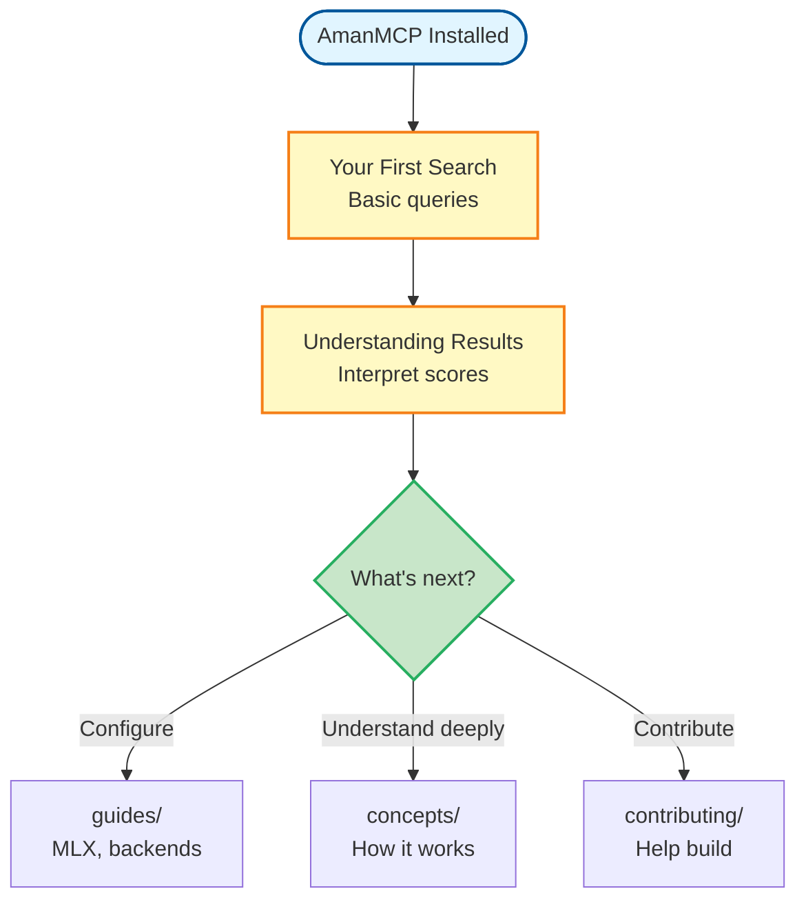

# Tutorials: Learn by Doing

Hands-on, step-by-step tutorials to learn AmanMCP through practice. Each tutorial includes expected output so you know you're on track.

---

## Who This Is For

These tutorials are for:
- Users who learn best by doing
- Anyone who wants practical experience before diving into concepts
- Developers who want to verify AmanMCP is working correctly

**Prerequisites:** AmanMCP installed and initialized. See [Getting Started](../getting-started/).

---

## Tutorials

| Tutorial | What You'll Do | Time |
|----------|----------------|------|
| [Your First Search](your-first-search.md) | Run searches, understand results, try different queries | 10 min |
| [Understanding Results](understanding-results.md) | Learn why certain results appear, how to interpret scores | 15 min |

---

## Learning Path



---

## Before You Start

### Verify Installation

```bash
# Check AmanMCP is installed
amanmcp version

# Expected output:
# amanmcp v0.4.0 (...)
```

### Verify Project is Indexed

```bash
# Navigate to your project
cd your-project

# Check index status
amanmcp status

# Expected: shows indexed files, last update time
```

**Not indexed yet?** Run `amanmcp init` first.

---

## Tutorial Format

Each tutorial follows this structure:

1. **Goal** - What you'll accomplish
2. **Prerequisites** - What you need before starting
3. **Steps** - What to do, with expected output
4. **Verification** - How to know you succeeded
5. **Next Steps** - Where to go from here

We show expected output for every command so you can verify you're on track.

---

## Tutorials Overview

### [Your First Search](your-first-search.md)

**You'll learn:**
- How to run a basic search
- Different ways to search (code, docs, all)
- How to interpret results
- Tips for effective queries

**By the end:** You'll have run multiple searches and understand what the results mean.

---

### [Understanding Results](understanding-results.md)

**You'll learn:**
- What the score numbers mean
- Why certain results rank higher
- How hybrid search affects ranking
- Debugging when results aren't what you expected

**By the end:** You'll understand how to interpret and improve your search results.

---

## Troubleshooting

### "No results found"

```bash
# Verify the index exists
amanmcp status

# Re-index if needed
amanmcp reindex
```

### "Command not found: amanmcp"

```bash
# Check if amanmcp is in PATH
which amanmcp

# If not found, add to PATH or reinstall
# See Getting Started guide
```

### "Index is out of date"

```bash
# Update the index
amanmcp reindex

# Or enable auto-reindexing
# See guides/auto-reindexing.md
```

---

## After Tutorials

| When You're Ready For... | Go To |
|--------------------------|-------|
| Task-based how-tos | [Guides](../guides/) |
| How things work | [Concepts](../concepts/) |
| Configuration options | [Reference](../reference/) |
| Contributing | [Contributing](../contributing/) |

---

*Tutorials are for learning. For task completion, see [Guides](../guides/). For looking things up, see [Reference](../reference/).*
