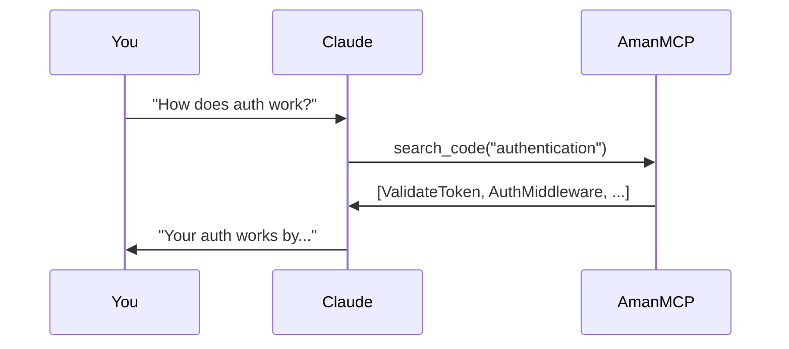

# Tutorial: Your First Search

Run your first AmanMCP searches and understand what the results mean.

**Time:** 10 minutes
**Prerequisites:** AmanMCP installed and project indexed

---

## Goal

By the end of this tutorial, you will:
- Run basic code searches
- Use different search commands
- Understand the result format
- Know tips for effective queries

---

## Step 1: Verify Your Setup

First, make sure everything is ready.

### Check AmanMCP is installed

```bash
amanmcp version
```

**Expected output:**
```
amanmcp v0.4.0 (...)
```

### Check your project is indexed

```bash
cd /path/to/your/project
amanmcp status
```

**Expected output:**
```
AmanMCP Status
─────────────────────────────
Project:     /path/to/your/project
Indexed:     1,234 chunks from 456 files
Last Update: 2 minutes ago
Backend:     ollama (nomic-embed-text)
```

**Not indexed?** Run `amanmcp init` first.

---

## Step 2: Run Your First Search

Let's search for something common in most codebases.

### Basic search

```bash
amanmcp search "error handling"
```

**Expected output:**
```
Found 8 results for "error handling"

1. internal/handler/errors.go:24-45 (score: 0.89)
   func handleError(err error, ctx *Context) {
       if err == nil {
           return
       }
       log.Printf("error: %v", err)
       ...

2. pkg/retry/backoff.go:56-78 (score: 0.82)
   func RetryWithBackoff(fn func() error) error {
       for attempt := 0; attempt < maxRetries; attempt++ {
           if err := fn(); err != nil {
               ...

3. ...
```

**What you see:**
- File path and line numbers
- A relevance score (0 to 1)
- A preview of the matching code

---

## Step 3: Try Different Search Types

AmanMCP has several search commands:

### Search code only

```bash
amanmcp search_code "authentication"
```

Searches only source code files (`.go`, `.py`, `.js`, etc.).

### Search documentation

```bash
amanmcp search_docs "getting started"
```

Searches only documentation files (`.md`, `.txt`, etc.).

### Search everything

```bash
amanmcp search "config"
```

Searches all indexed content.

---

## Step 4: Understand the Results

Let's break down a result:

```
internal/auth/validate.go:15-42 (score: 0.87)
func ValidateToken(token string) (*Claims, error) {
    if token == "" {
        return nil, ErrEmptyToken
    }
    ...
```

| Part | Meaning |
|------|---------|
| `internal/auth/validate.go` | File path relative to project root |
| `15-42` | Line numbers (start-end) |
| `score: 0.87` | Relevance score (0.0 to 1.0, higher = more relevant) |
| The code | Preview of the matching chunk |

### About Scores

- **0.9+** - Very strong match
- **0.7-0.9** - Good match
- **0.5-0.7** - Moderate match
- **Below 0.5** - Weak match (might still be useful)

---

## Step 5: Try Different Queries

### Exact function name

```bash
amanmcp search_code "func ProcessPayment"
```

BM25 (keyword search) excels at finding exact identifiers.

### Conceptual query

```bash
amanmcp search_code "handle user login"
```

Vector (semantic search) finds conceptually related code even if words don't match exactly.

### Mixed query

```bash
amanmcp search_code "validate JWT token"
```

Hybrid search finds both exact matches ("JWT", "token") and related concepts ("validate" → "verify").

---

## Step 6: Refine Your Searches

### Too many results?

Be more specific:
```bash
# Instead of:
amanmcp search "error"

# Try:
amanmcp search "database connection error"
```

### Not finding what you expect?

Try different terms:
```bash
# If "authentication" doesn't work, try:
amanmcp search "login"
amanmcp search "credentials"
amanmcp search "verify user"
```

### Looking for a specific file type?

Use the appropriate search command:
```bash
# Code only
amanmcp search_code "pattern"

# Docs only
amanmcp search_docs "pattern"
```

---

## Step 7: Use with AI Assistant

The real power is using AmanMCP with Claude or another AI assistant.

### In Claude Code

Just ask questions naturally:
```
"How does authentication work in this project?"
"Where is the payment processing logic?"
"Show me the error handling patterns used here."
```

Claude automatically uses AmanMCP to search your code and provide informed answers.

### What happens behind the scenes



---

## Verification

You've completed this tutorial if you can:

- [ ] Run `amanmcp search "something"` and see results
- [ ] Understand what the score means
- [ ] Find specific functions by name
- [ ] Find conceptually related code

---

## Common Issues

### "No results found"

```bash
# Check your index
amanmcp status

# Rebuild if needed
amanmcp reindex
```

### Results are outdated

```bash
# Update the index
amanmcp reindex

# Or enable auto-reindexing (see guides)
```

### Wrong files being searched

Check your exclusion patterns:
```bash
cat .amanmcp/config.yaml
```

Make sure important files aren't excluded.

---

## Tips for Better Searches

| Tip | Example |
|-----|---------|
| Be specific | "database connection pool" not just "database" |
| Use domain terms | "authentication middleware" not "login thing" |
| Try synonyms | "error" vs "exception" vs "failure" |
| Mix concepts | "retry with exponential backoff" |

---

## Next Steps

**Next Tutorial:** [Understanding Results](understanding-results.md) - Learn why certain results rank higher

**Or explore:**
- [Guides](../guides/) - Configure MLX, auto-reindexing
- [Concepts](../concepts/) - How hybrid search works
- [Reference](../reference/) - All CLI commands
